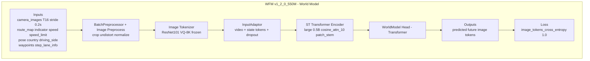
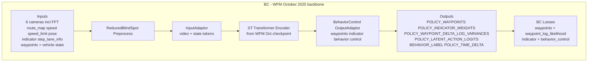
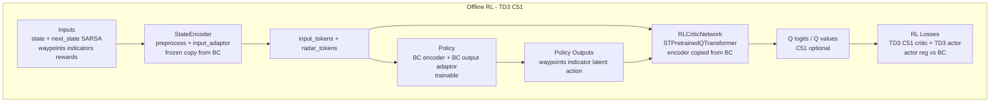
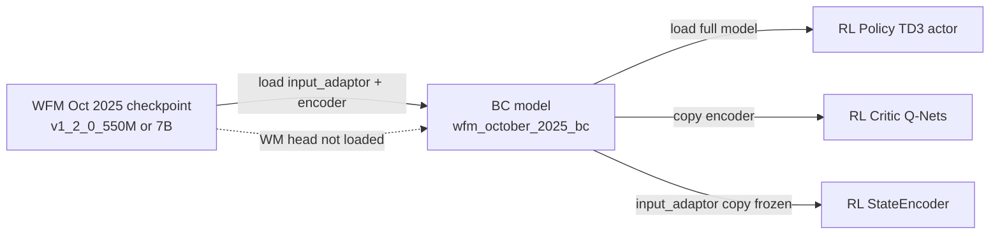
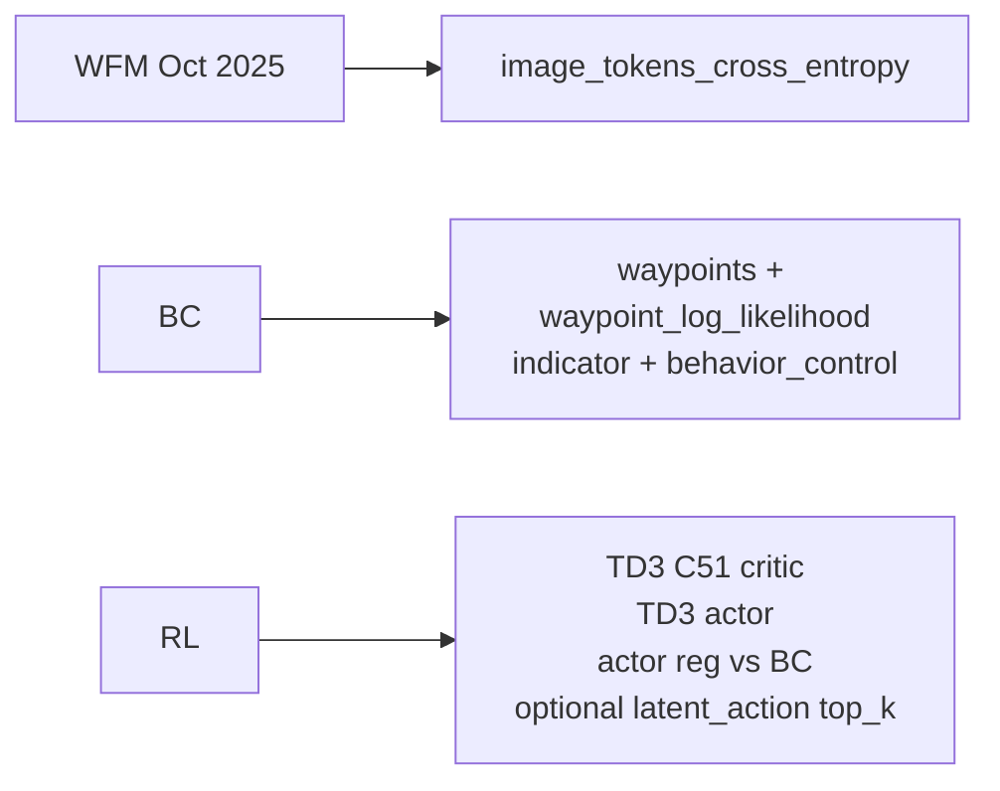
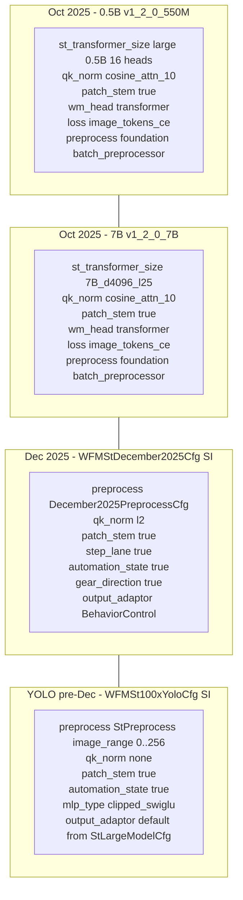

# WFM -> BC -> RL (Oct 2025) — Mermaid diagrams

## Sources (code anchors)
- `/workspace/WayveCode/wayve/ai/foundation/models/world_model/config/releases/v1_2_0_550M.yml`
- `/workspace/WayveCode/wayve/ai/foundation/models/world_model/config/releases/v1_2_0_7B.yml`
- `/workspace/WayveCode/wayve/ai/foundation/models/world_model/config/builders.py`
- `/workspace/WayveCode/wayve/ai/zoo/st/models.py`
- `/workspace/WayveCode/wayve/ai/zoo/st/checkpoints.py`
- `/workspace/WayveCode/wayve/ai/zoo/outputs/output_adaptor.py`
- `/workspace/WayveCode/wayve/ai/si/config.py`
- `/workspace/WayveCode/wayve/ai/si/losses/bc_loss_module.py`
- `/workspace/WayveCode/wayve/ai/si/configs/store/offline_rl.py`
- `/workspace/WayveCode/wayve/ai/si/models/offline_rl.py`
- `/workspace/WayveCode/wayve/ai/si/offline_rl/rl_critic_network.py`

## WFM Oct 2025 (v1_2_0_550M) — components + I/O

## BC (wfm_october_2025_bc) — components + I/O

## RL (wfm_oct_rl) — components + I/O

## Layer reuse across stages

## Loss comparison (stage-level)

## WFM model comparison (Oct 0.5B vs Oct 7B vs Dec 2025 vs YOLO)

## Notes
- Oct 0.5B and Oct 7B are foundation WFM release configs (world-model pretraining).
- Dec 2025 and YOLO are SI WFM configs used for driving BC RL (space-time model + behavior control adaptor).
- BC is initialized from Oct 2025 WFM by loading input_adaptor + encoder only (no WM head). RL then loads the full BC model and copies encoder weights into the critic.

## Excalidraw
- [[2026/01/Week-3/2026-01-17-wfm-bc-rl-excalidraw]]
