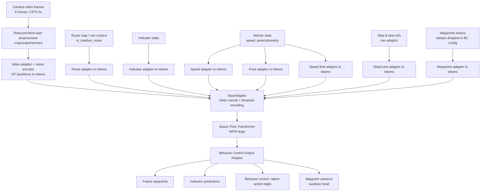
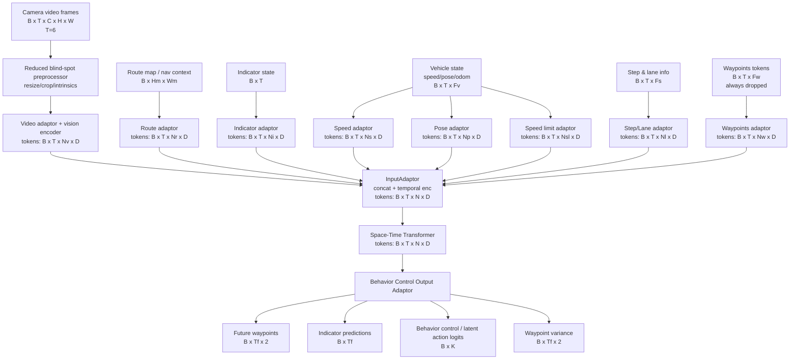
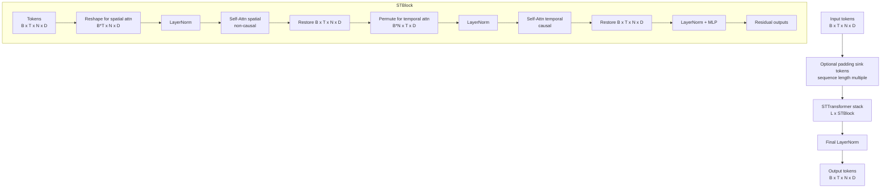

# 2025-12-29 — Task Summary — Release BC Model Mermaid

## Scope
- Goal: Provide a high-level mermaid diagram for the release BC model (inputs, layers, outputs).

## Sources
- Model config: `/workspace/WayveCode/wayve/ai/si/configs/baseline/release.py`
- WFM model + preprocess config: `/workspace/WayveCode/wayve/ai/si/config.py`
- ST model assembly: `/workspace/WayveCode/wayve/ai/zoo/st/models.py`
- Behavior control output adaptor: `/workspace/WayveCode/wayve/ai/latent_actions/models/outputs_behavior_control.py`

## Deliverable
- Mermaid diagram shared in chat response.

## Update
- Provided a Mermaid-safe label variant (use   and avoid parentheses).

## Mermaid Diagram

## Mermaid Diagram With Shapes

## ST Transformer Components Diagram

