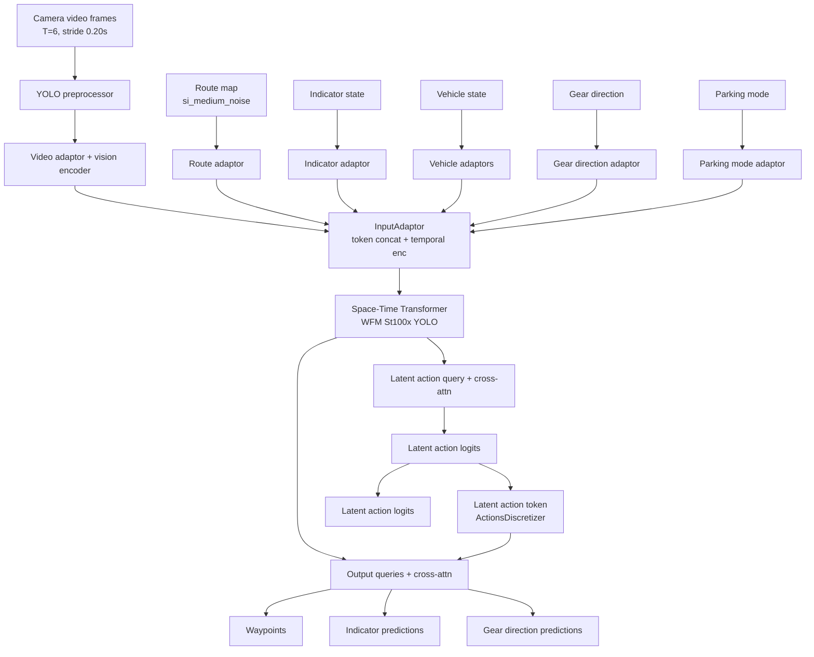
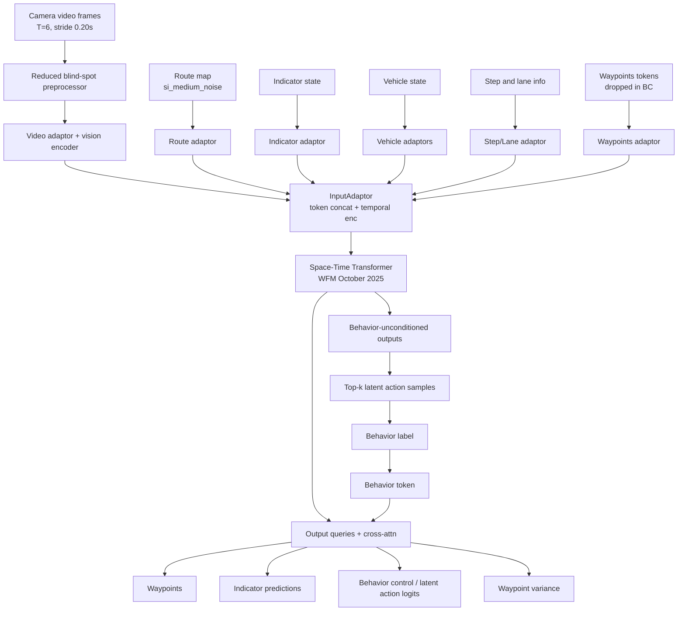

# 2026-01-05 — Task Summary — Parking BC vs Release BC (Latent Actions)

## Scope
- Compare ParkingBcTrainCfg (current branch) vs release BC baseline (main).
- Focus on latent action and behavior control differences.
- Provide Mermaid diagrams for each.

## Sources
- /workspace/WayveCode/wayve/ai/si/configs/parking/parking_config.py
- /workspace/WayveCode/wayve/ai/zoo/outputs/output_adaptor.py
- /workspace/WayveCode/wayve/ai/zoo/outputs/latent_action_module.py
- /workspace/WayveCode/wayve/ai/latent_actions/models/outputs_behavior_control.py
- /workspace/WayveCode/wayve/ai/si/config.py (main)
- /workspace/WayveCode/wayve/ai/si/configs/baseline/release.py (main)

## Reference
- [[2025/12/Week-5/2025-12-29-release-bc-model-mermaid-summary]]

## Hydra-zen config composition
- ParkingBcTrainCfg: make_config(bases=(BCWFMSt100xYoloCfg,), model=parking_bc_cfg, ...).
- parking_bc_cfg: STTrainingModuleCfg(model=ParkingModelCfg(), bc_losses=default_losses_parking, enable_behavior_control=False, use_gear_direction=True, use_parking_mode=True).
- ParkingModelCfg: make_config(bases=(WFMSt100xYoloCfg,), output_adaptor=ParkingOutputAdaptorCfg(), use_gear_direction_adaptor, use_parking_mode_adaptor).
- Release BC baseline: BcBaselineCfg in release.py uses baseline_bc_model (StBcCfg) with WFMStOctober2025Cfg and enable_behavior_control=True.
- WFMStOctober2025Cfg uses BehaviorControlOutputAdaptorCfg from wayve/ai/si/config.py (main).

## Latent action differences (key)
- Parking model uses the new zoo OutputAdaptor with enable_latent_action tied to bc_losses.w_latent_action (1.0) and enable_behavior_control=False.
- Release baseline uses the legacy BehaviorControlOutputAdaptor with w_behavior_control=1.0 and no explicit latent action loss in the release config.
- Both use ActionsDiscretizer with matching parameters (timesteps=2.0, n=(31, 31), radial-exponent, rad_exp=1.7, max_speed=36.0).
- Parking injects a latent action token directly into the token stream to condition outputs; release injects a behavior token computed from top-k latent action samples.
- Parking latent action encoding flips target waypoint x for reverse gear; release behavior control adaptor does not apply gear-direction handling.
- Parking enables gear-direction prediction and parking mode adaptor; release baseline does not enable these heads/adaptors.

## Mermaid — ParkingBcTrainCfg (latent action enabled)

## Mermaid — Release BC baseline in main (behavior control)

