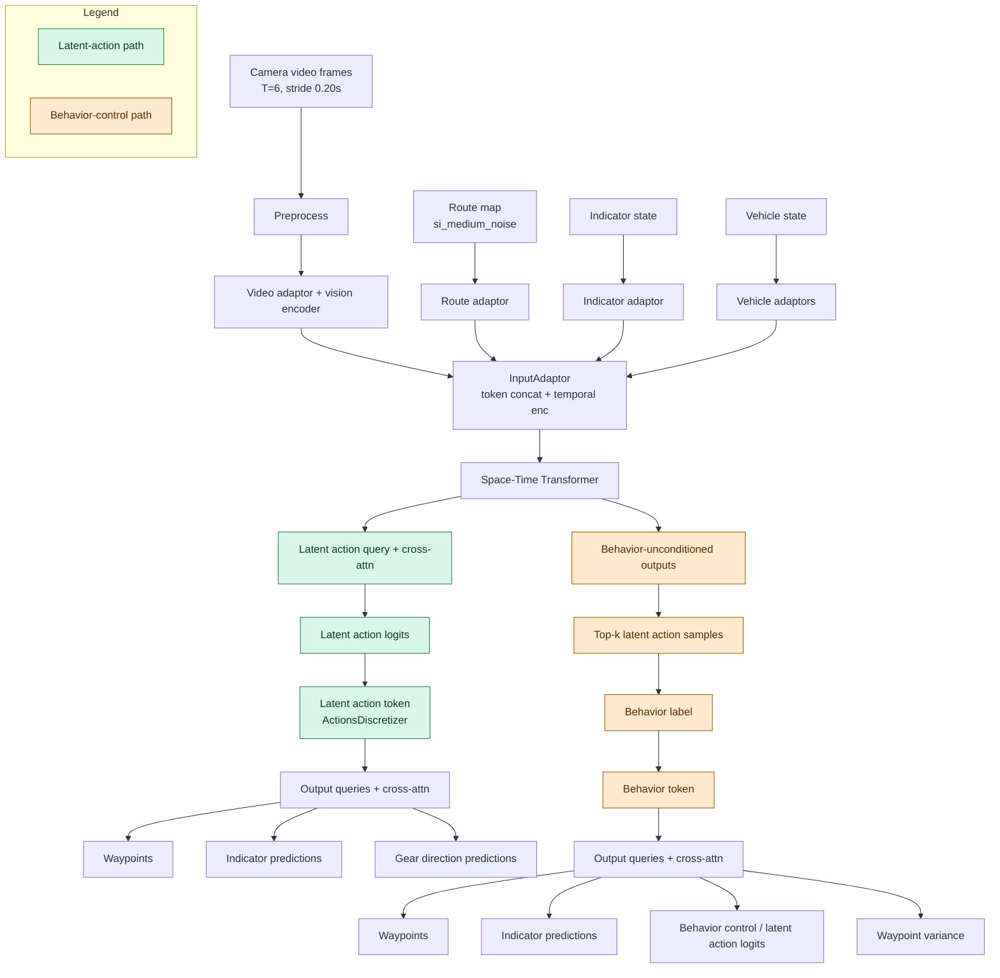

# 2026-01-05 — Task Summary — Parking BC vs Release BC (Latent Actions)

## Scope
- Compare ParkingBcTrainCfg (current branch) vs release BC baseline (main).
- Focus on latent action and behavior control differences.
- Provide Mermaid diagrams for each.

## Sources
- /workspace/WayveCode/wayve/ai/si/configs/parking/parking_config.py
- /workspace/WayveCode/wayve/ai/zoo/outputs/output_adaptor.py
- /workspace/WayveCode/wayve/ai/zoo/outputs/latent_action_module.py
- /workspace/WayveCode/wayve/ai/latent_actions/models/outputs_behavior_control.py
- /workspace/WayveCode/wayve/ai/si/config.py (main)
- /workspace/WayveCode/wayve/ai/si/configs/baseline/release.py (main)

## Reference
- [[2025/12/Week-5/2025-12-29-release-bc-model-mermaid-summary]]

## Hydra-zen config composition
- ParkingBcTrainCfg: make_config(bases=(BCWFMSt100xYoloCfg,), model=parking_bc_cfg, ...).
- parking_bc_cfg: STTrainingModuleCfg(model=ParkingModelCfg(), bc_losses=default_losses_parking, enable_behavior_control=False, use_gear_direction=True, use_parking_mode=True).
- ParkingModelCfg: make_config(bases=(WFMSt100xYoloCfg,), output_adaptor=ParkingOutputAdaptorCfg(), use_gear_direction_adaptor, use_parking_mode_adaptor).
- Release BC baseline: BcBaselineCfg in release.py uses baseline_bc_model (StBcCfg) with WFMStOctober2025Cfg and enable_behavior_control=True.
- WFMStOctober2025Cfg uses BehaviorControlOutputAdaptorCfg from wayve/ai/si/config.py (main).

## Latent action differences (key)
- Parking model uses the new zoo OutputAdaptor with enable_latent_action tied to bc_losses.w_latent_action (1.0) and enable_behavior_control=False.
- Release baseline uses the legacy BehaviorControlOutputAdaptor with w_behavior_control=1.0 and no explicit latent action loss in the release config.
- Both use ActionsDiscretizer with matching parameters (timesteps=2.0, n=(31, 31), radial-exponent, rad_exp=1.7, max_speed=36.0).
- Parking injects a latent action token directly into the token stream to condition outputs; release injects a behavior token computed from top-k latent action samples.
- Parking latent action encoding flips target waypoint x for reverse gear; release behavior control adaptor does not apply gear-direction handling.
- Parking enables gear-direction prediction and parking mode adaptor; release baseline does not enable these heads/adaptors.

## Torch pseudocode (behavior-control vs latent-action)
### Release baseline (behavior-control adaptor)
```python
# tokens: [B, T, N, D] from ST encoder
tokens = outputs["output_tokens"]
tokens = tokens.flatten(1, 2)  # [B, T*N, D]

if policy_waypoints_present:  # training path
    # Behavior-unconditioned policy (no behavior token)
    latent_logits = latent_action_head(latent_query, tokens)  # [B, 1, K]
    latent_embed = codebook(argmax_or_privileged(latent_logits))  # [B, 1, D]
    tokens_bu = tokens + latent_embed.expand_as(tokens)  # [B, T*N, D]
    waypoints_bu = waypoint_head(tokens_bu)  # [B, Tf, 2]

    # Top-k latent action sampling to compute behavior label
    topk_logits, topk_idx = topk(latent_logits, k=K)  # [B, 1, K]
    topk_emb = codebook(topk_idx)  # [B, 1, K, D]
    tokens_topk = tokens[:, None].expand(B, K, -1, -1).reshape(B*K, T*N, D)  # [B*K, T*N, D]
    tokens_topk = tokens_topk + topk_emb.squeeze(1).reshape(B*K, 1, D).expand(B*K, T*N, D)
    waypoints_topk = waypoint_head(tokens_topk).reshape(B, K, Tf, 2)  # [B, K, Tf, 2]
    behavior_label = compute_behavior_label(waypoints_topk, policy_waypoints, topk_logits)  # [B]
else:  # inference path
    behavior_label = fixed_behavior_input * torch.ones(B)  # [B]

# Behavior token conditions the final outputs
behavior_token = behavior_codebook(behavior_label)  # [B, D]
tokens = tokens + behavior_token[:, None, :].expand(B, T*N, D)  # [B, T*N, D]
waypoints = waypoint_head(tokens)  # [B, Tf, 2]
indicator = indicator_head(tokens)  # [B, Tf]
```

### Parking (latent-action adaptor)
```python
# tokens: [B, T, N, D] from ST encoder
tokens = outputs["output_tokens"]
tokens = tokens.flatten(1, 2)  # [B, T*N, D]

if policy_waypoints_present:  # training path
    target_wp = policy_waypoints[..., -1, :2]  # [B, 2]
    if gear_direction_present:  # reverse: invert x
        target_wp = invert_x_if_reverse(target_wp, gear_dir)  # [B, 2]
    latent_idx = discretizer.encode(target_wp)  # [B]
    privileged_latent = latent_idx[:, None]  # [B, 1]
else:  # inference path
    privileged_latent = None

# Latent action conditioning (always active)
latent_logits = latent_action_head(latent_query, tokens)  # [B, 1, K]
latent_embed = codebook(privileged_latent or argmax(latent_logits))  # [B, 1, D]
tokens = tokens + latent_embed.expand(B, T*N, D)  # [B, T*N, D]

waypoints = waypoint_head(tokens)  # [B, Tf, 2]
indicator = indicator_head(tokens)  # [B, Tf]
gear_direction = gear_head(tokens)  # [B, Tf]
```

## Mermaid — Combined (latent action vs behavior control)


## Perf estimate (inference)
- Dominant FLOPs remain in the vision encoder + ST transformer attention (O(N^2) in token count per frame).
- New gear/parking input adaptors add only a few tokens per frame, so the attention cost increase is small relative to video tokens.
- Latent-action cross-attn is a single-query attention over tokens plus a small MLP head; its FLOPs are tiny vs ST layers.
- Gear-direction output head adds one query and a small linear layer; negligible vs ST.
- Parking deployment wrapper adds torch.where and small indexing; not a FLOP-heavy path.
