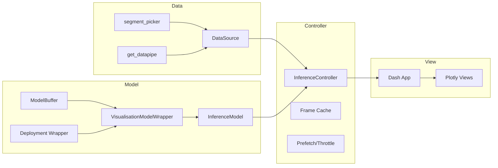
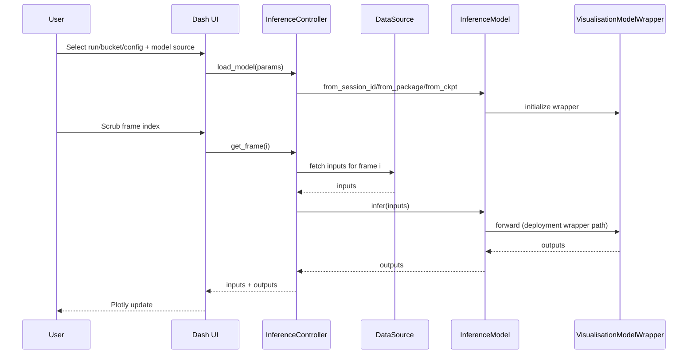

# New inference vis tool: initial mapping

## Summary
- Read existing SI visualisation flows (Bokeh server, offline scripts, model wrapper, datapipe selection).
- Mapped how model + deployment wrapper + data sources are wired today.
- Proposed reuse plan and MVC structure for the new tool.

## Current solution map
- Entry point: `wayve/ai/si/visualisation/bokeh/visualise.py` orchestrates args, model loading, datapipe, plotter, and server/HTML/MP4 output.
- Model wrapper: `wayve/ai/si/visualisation/inference_model.py` (VisualisationModelWrapper + ModelBuffer) handles casting, camera mapping, deployment wrapper call path, and unbatching outputs.
- Data sources: `wayve/ai/si/visualisation/run_segment_picker.py` parses segments from JSON/YAML/dataset/CLI and builds datapipes via `make_driving_datapipe_for_run_id`.
- Packaging: `wayve/ai/si/visualisation/pack_model.py` creates torch packages from session IDs for inference usage.
- Plotting: `wayve/ai/si/visualisation/bokeh/plotter/*` defines InputPlotter/InputOutputPlotter/ParkingPlotter and required input/output keys.
- Offline renderer: `wayve/ai/si/visualisation/scripts/visualise.py` uses Ray + visualisation.lib for MP4 generation.

## Reuse plan (MVC)
- Model: create an `InferenceModel` wrapper using `ModelBuffer` + `VisualisationModelWrapper` with factories for session/package/ckpt/torchscript.
- Controller: `InferenceController` that binds `DataSource` + `InferenceModel`, caches frames, and exposes `get_frame(idx)`.
- View: Plotly-based views for camera panels, BEV, speed/curvature, indicator/gear, and map; use existing key lists to define required inputs/outputs.
- DataSource: adapter around `segment_picker` + `get_datapipe` to support run id, bucket, and train/val config selection.

## Suggested direction
- Prefer Dash + Plotly for MVC alignment and multi-pane state synchronization.
- Keep Gradio as a fast-prototype fallback if needed.

## Gradio + Plotly vs Dash + Plotly
**Fit for MVC**
- Dash: Strong. Clear separation of layout (View) and callbacks (Controller) with reusable model layer.
- Gradio: OK for single-flow apps, but MVC separation gets blurry with chained event handlers.

**State + caching**
- Dash: Server-side caching patterns (memoization, background callbacks) are well established; easier to coordinate multi-view state.
- Gradio: Simpler state primitives; workable but more friction for complex shared state.

**Multi-pane layouts**
- Dash: Built for dashboard grids and coordinated plots.
- Gradio: Layouts are fine for moderate complexity, harder to manage dense multi-panel visualizations.

**Performance + data volume**
- Dash: Better control over update granularity; easier to optimize per-component updates.
- Gradio: Great for demos, but large per-frame payloads can feel sluggish without more custom work.

**Developer speed**
- Gradio: Fastest to prototype and iterate UI.
- Dash: More boilerplate, but scales better once complexity grows.

**Recommendation**
- Use Dash + Plotly for the main tool (MVC alignment + multi-view sync).
- Optionally build a lightweight Gradio demo that reuses the Plotly view builders for quick internal sharing.

## Diagrams
### MVC components

### Data and inference flow

## Open questions
- Which plotter types need parity (InputOutput vs Parking)?
- Should the tool support offline HTML/MP4 export like current flows?
- How should train/val config resolve to dataset paths in the UI?
