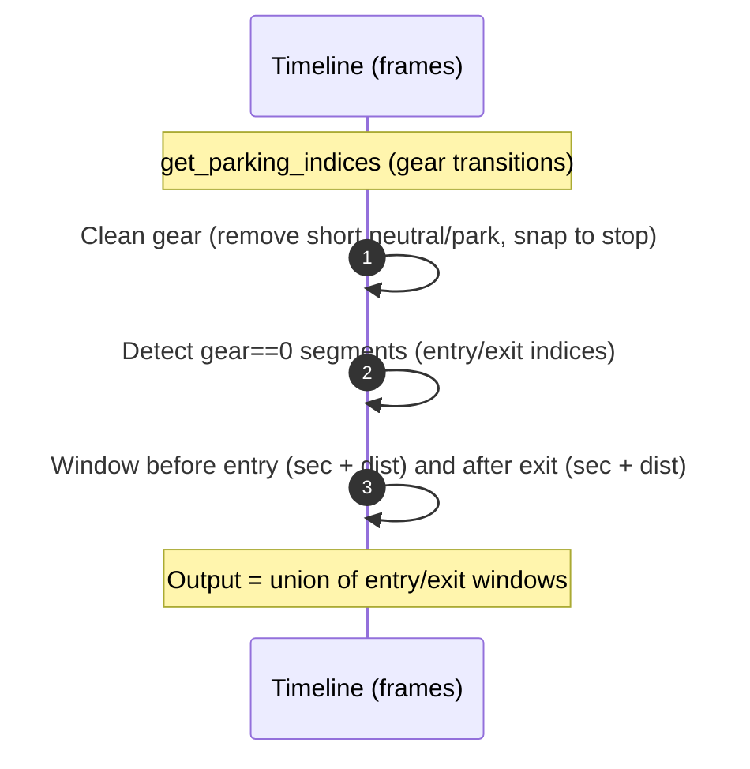
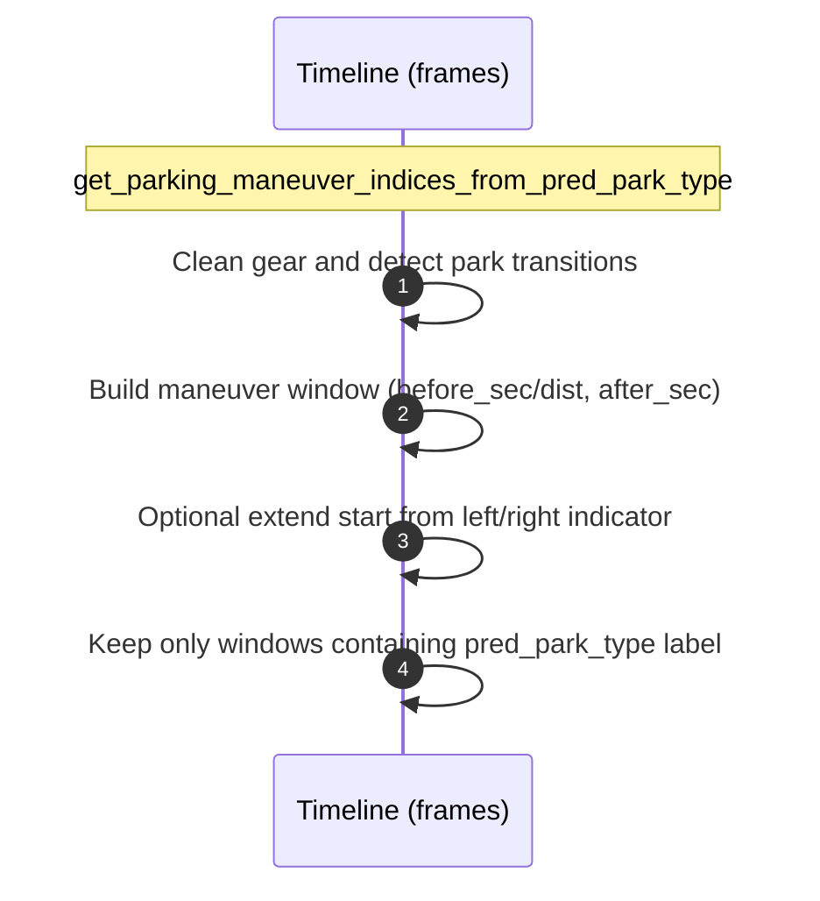

# 2026-01-13 — Task Summary — Parking hazard filter updates

- Status: done
- Goal: Add hazard-based parking maneuver filter and align parking filters/masks for hazard handling.

## Progress
- Added `get_parking_maneuver_indices_from_hazard_indicator_light` using hazard indicator light + gear==0 with optional left/right indicator extension.
- Extended `_get_parking_maneuver_mask_and_index` with indicator extension options and allowed indicator states.
- Added gear cleanup to `get_parking_indices` to remove short neutral/park runs before transition detection.
- Updated masks to include `hazard_indicator` in `_DEFAULT_MASKS` and removed `exclude_hazard_indicators` parameter usage.
- Added tests for hazard indicator light filtering and cleaned parking segments.
- Removed hazard location filtering (geofence/radius) from the hazard filter.

## Filter Timeline (Mermaid)




```mermaid
sequenceDiagram
    autonumber
    participant T as Timeline (frames)
    Note over T: get_parking_maneuver_indices_from_hazard_indicator_light
    T->>T: Clean gear; require hazard_light AND gear==0
    T->>T: Build maneuver window (before_sec/dist, after_sec)
    T->>T: Optional extend start from left/right indicator
    T->>T: Keep only windows containing hazard+gear==0
```

## Tests
- Not run (suggested): `bazel test //wayve/ai/zoo:test_sampling_py_test --test_output=errors`

## Files
- `wayve/ai/zoo/sampling/filters.py`
- `wayve/ai/zoo/sampling/constants.py`
- `wayve/ai/zoo/sampling/buckets.py`
- `wayve/ai/zoo/test/sampling/test_filters.py`
- `wayve/ai/zoo/test/sampling/test_buckets.py`
