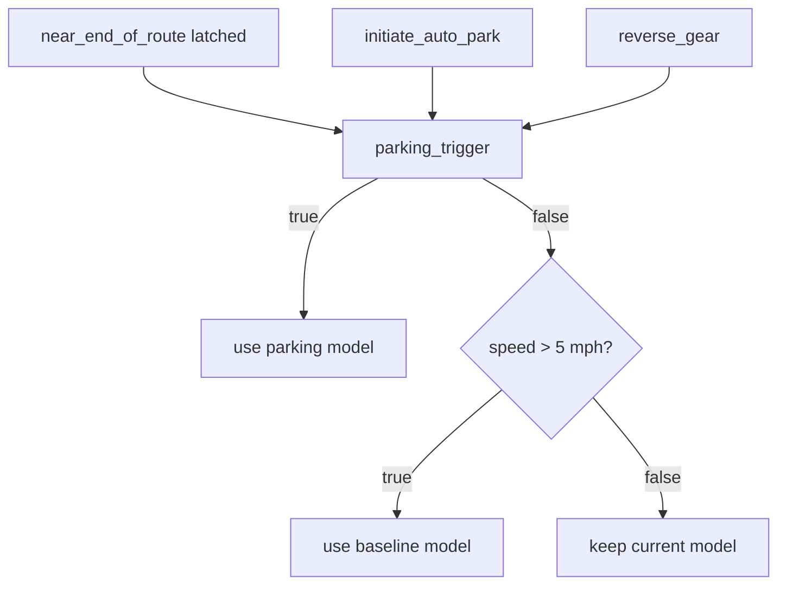

# The Interleaving Dispatch — Parking + Baseline Wrapper Newsletter

## Issue
We needed one deployable TorchScript artifact that can drive normally with a baseline model and seamlessly switch to a parking model when parking becomes relevant. The hard part was making TorchScript happy while keeping the switching logic deterministic and debuggable.

## What shipped
- A static route‑interleaving wrapper that compiles to TorchScript without codegen surprises.
- Baseline + parking models loaded from session IDs and packaged like a normal deploy run.
- Navigation instructions now flow through the parking wrapper too.
- A switching policy with **near‑end‑of‑route latching**, **auto‑park**, **reverse gear**, and **5 mph hysteresis**.

## How the switch works
We switch into parking mode when **any** of these are true:
- Near end of route (latched).
- Initiate auto‑park control is on.
- Reverse gear is engaged.

We only switch back to baseline when **all** parking triggers are false **and** speed is above 5 mph.



## Latch behavior in plain English
Near‑end‑of‑route can be noisy around the boundary. We latch it on first detection, then hold it until the vehicle has driven a configurable distance (default 50 m). Setting the distance to **0** disables the latch. The 5 mph hysteresis still applies.

## End‑of‑route = no route
We treat **end‑of‑route** as “no route available” (route signal is zero). When that happens the parking wrapper **forces parking mode on** so the system can auto‑stop gracefully.

## Gear output behavior
The baseline model doesn’t output `policy_gear_position`. When baseline is active we fill that field with `get_none_tensor_token()`. This means “no gear prediction.” The parking model always supplies a real `policy_gear_position`.

## Files to know
- Wrapper: `wayve/ai/zoo/deployment/interleaving_stopping_wrapper.py`
- Deploy script: `wayve/ai/si/deploy_interleaved_models.py`
- Parking wrapper: `wayve/ai/zoo/deployment/deployment_wrapper.py` (now includes nav inputs)

## Example run
```
DEV_VM=0 TMPDIR=/workspace/tmp bazel run //wayve/ai/si:deploy_interleaved_models -- \
  --baseline_model_session_id session_2026_01_15_13_16_36_si_candidate_2026_5_3_baseline_rl_with_refreshed_data_with_aac \
  --session_id session_2026_01_28_20_56_18_si_parking_bc_train_wfm_october_2025_pudo_7_17.01_october_wfm_bc \
  --suffix _retrace3 --dilc_on --enable_parking --with_temporal_caching true
```

## TorchScript corner
- We keep the wrapper’s **forward signature fixed** to avoid TorchScript graph churn.
- Output schema is fixed and optional fields are allowed, so the baseline can omit gear.
- We derive the static input/output keys from the wrapper signature and `RouteInterleavingOutput` fields to avoid brittle string lists.

## What’s next
- Make latch distance and speed hysteresis configurable via CLI.
- Add a small regression test to validate input/output keys for the two models.

That’s the update. If you want deeper traces or a runbook for debugging mismatched keys, I can add a follow‑up edition.
