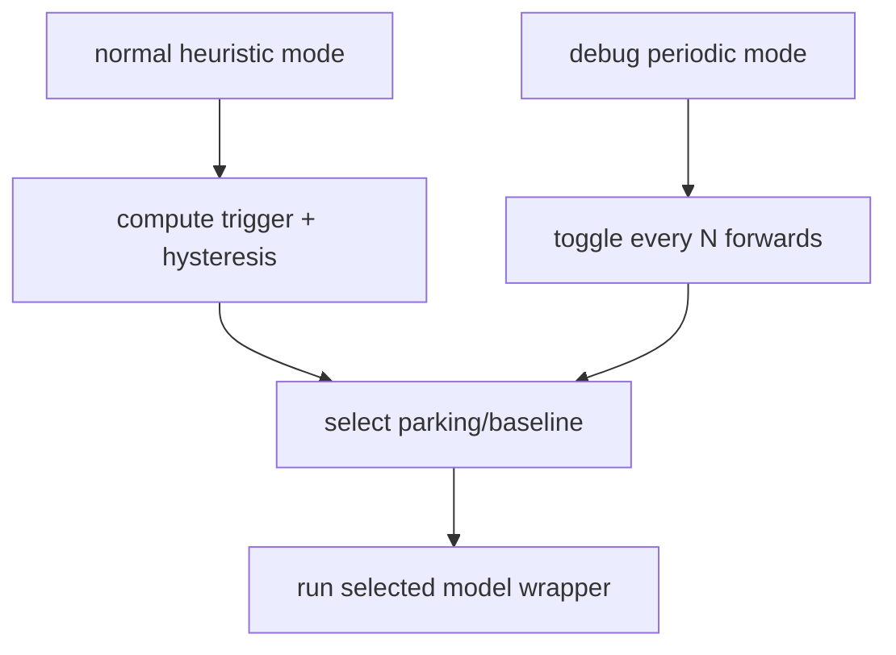

# The Interleaving Dispatch — February Update (Wrapper + Ingested Modes)

## Why this exists
We want one deployable session that can run either:
- baseline driving model, or
- parking model,

while looking like a normal single deployment wrapper model to downstream runtime.

## Current architecture (what actually ships)
- `RouteInterleavingWrapperImpl` inherits `DeploymentWrapperBase`.
- It implements `_forward_with_additional_inputs(...)` for branch selection + model dispatch.
- `make_wrapper_class(...)` generates the public `forward(...)` signature used by compile/runtime.
- Output type is fixed `RouteInterleavingOutput` (`OnBoardDrivingOutput` fields + interleaving telemetry).

## Load modes (latest decision)
Both models now share the same load-mode choices:
- `wrapper`
- `ingested`

The old `torchscript` mode was removed to keep behavior symmetric and reduce path-specific surprises.

### What each mode means
- `wrapper`: load from session checkpoint with `prepare_deployment_model(...)` path (deploy-like model construction).
- `ingested`: load already-ingested trace/module path via model ingest metadata.

## Switch behavior
Normal mode switches by heuristic:
- enter parking if any trigger is active:
  - near-end-of-route (latched),
  - initiate auto-park control,
  - reverse gear.
- return to baseline only when all parking triggers are false and speed hysteresis condition is satisfied.

Debug mode bypasses heuristic:
- `--switch_every_n_forwards N` toggles branch every `N` forward passes.



## Cache warmup behavior
After a branch switch, cached output can be returned for early frames:
- controlled by `--num_cache_warmup_frames`.
- `0` disables warmup cache reuse.

This is useful to A/B check whether instability comes from switching itself or post-switch cache warmup behavior.

## Telemetry
Wrapper always emits:
- `interleaved_id`: active model branch.
- `interleaved_event`: switch event marker (`1` on switch frame, else `0`).

## Commands we used recently
### Periodic switching + no cache warmup
```bash
bazel run //wayve/ai/si:deploy_interleaved_models -- \
  --baseline_model_session_id session_2026_01_15_13_16_36_si_candidate_2026_5_3_baseline_rl_with_refreshed_data_with_aac \
  --baseline_model_load_mode wrapper \
  --primary_model_load_mode wrapper \
  --session_id session_2026_01_28_20_56_18_si_parking_bc_train_wfm_october_2025_pudo_7_17.01_october_wfm_bc \
  --suffix interleaving_30_no_cache \
  --dilc_on \
  --enable_parking \
  --with_temporal_caching true \
  --switch_every_n_forwards 30 \
  --num_cache_warmup_frames 0 \
  --upload
```

## Known HIL failure signature (important)
When switching variants fail, the key runtime signature seen is:
- `RuntimeError: This Python function is annotated to be ignored and cannot be run`
- stack under perceiver attention path (`use_flash_attention_v2` branch).

Interpretation:
- this is not just a timeout;
- the forward loop crashes in model execution, and then CI reports insufficient forward passes.

## Practical checklist before upload
1. Confirm both load modes explicitly (`wrapper|ingested`) for primary and baseline.
2. Confirm switch mode (`heuristic` vs `switch_every_n_forwards`).
3. Confirm cache warmup (`num_cache_warmup_frames`).
4. Confirm upload suffix is unique for traceability.
5. Watch logs for the flash-attention ignored-function runtime signature.

## Current test matrix snapshot
- `__interleaved6`: known-good reference behavior.
- `interleaved_every_30`: periodic switch variant used to isolate switch-path failures.
- `__interleaved_every_30_2`: follow-up periodic switch upload.
- `interleaving_30_no_cache`: periodic switch with warmup cache disabled.
