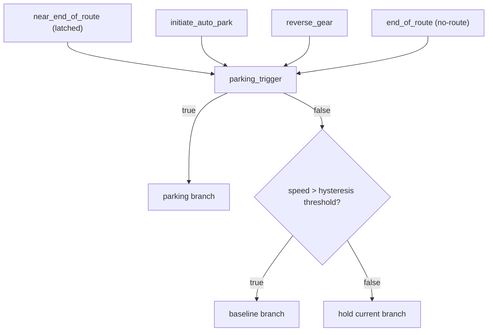

# Newsletter: The Interleaving Dispatch — Production Design Edition

## Goal
Produce one deployable session that behaves like a normal deployment-wrapper model, but internally switches between:
- baseline driving model
- parking model

No external interleave orchestrator is required for this path.

## Architecture
- `RouteInterleavingWrapperImpl` inherits `DeploymentWrapperBase`.
- Interleaving is implemented in `_forward_with_additional_inputs(...)`.
- Public `forward(...)` is generated via `make_wrapper_class(...)` so deploy/runtime see a normal wrapper signature.
- Output contract is fixed by `RouteInterleavingOutput`:
  - standard onboard driving outputs
  - plus `interleaved_id` and `interleaved_event` telemetry.

## Model load modes (intended)
Both branches use the same load-mode choices:
- `wrapper`
- `ingested`

Why this is the intended setup:
- symmetric behavior/config between primary and baseline branches
- easier to reason about deploy parity and failure modes
- fewer path-specific surprises.

## Switching policy (intended production)
Use parking branch when any trigger is active:
- near-end-of-route (latched)
- initiate auto-park
- reverse gear
- end-of-route/no-route

Return to baseline only when parking triggers are inactive and speed hysteresis condition allows it.



## Warmup handling after switch
- `num_cache_warmup_frames` controls post-switch warmup behavior.
- Keep this as a deployment knob so switch-boundary stability can be tuned without changing wrapper topology.

## Reference implementation notes that should stay
### `zmurez/pudo` (`compile_with_baseline.py`)
- Keep this as the reference for interleaving compile decisions and attention-path handling.
- Use it when checking parity around deploy init assumptions and runtime behavior.

### `main` (`interleaved_wrapper.py`)
- Keep this as the reference for interleaving telemetry semantics:
  - `interleaved_id`
  - `interleaved_event`
- Aligning with main makes logs/analysis easier to compare across implementations.

## Recommended deployment command shape
```bash
bazel run //wayve/ai/si:deploy_interleaved_models -- \
  --baseline_model_session_id <baseline_session_id> \
  --baseline_model_load_mode wrapper \
  --primary_model_load_mode wrapper \
  --session_id <parking_session_id> \
  --suffix <new_suffix> \
  --dilc_on \
  --enable_parking \
  --with_temporal_caching true \
  --upload
```

## Guardrails
1. Keep deploy inputs/initialization aligned with `deploy.py`.
2. Keep switching policy in one place (interleaving wrapper), not split across wrappers.
3. Preserve telemetry outputs so branch activity is observable in logs/tools.
4. Treat debug-only paths as temporary and avoid documenting them as target behavior.
