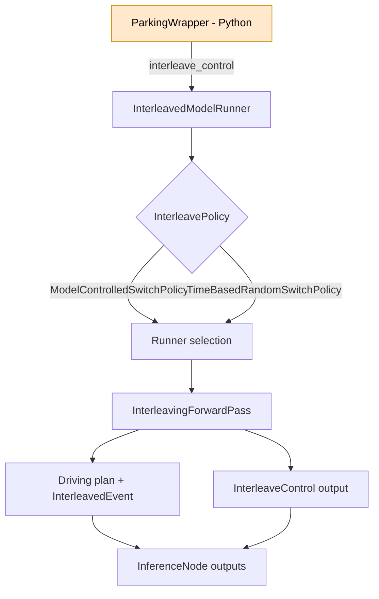

# Interleaving models in parking deployment wrapper

## Overview
- **What it is:** Extend the parking deployment wrapper to interleave the baseline driving model with the parking/PUDA model based on heuristics (e.g., end-of-route).
- **Why it matters:** Enables correct model switching for parking scenarios on-vehicle.
- **Primary users:** Not specified yet.

## Status
- **Phase:** Phase 1
- **Status:** active
- **Last updated:** 2026-02-03
- **Current priorities:**
  - Review `zmurez/pudo` and map the interleaving flow to our wrapper.
  - Define the switching heuristics and model-selection interface.
  - Confirm deployment path (TRT + 2-model experiment) vs wrapper-only fallback.
- **Blockers:**
  - None

## Requirements
- **Problem statement:** Run two models on-vehicle (baseline + parking/PUDA) and switch to parking/PUDA when heuristics trigger. Extend the parking deployment wrapper to support this.
- **Target users:** Not specified yet.
- **Integrations:** Parking deployment wrapper; reference branch `zmurez/pudo`.
- **Constraints:** TBD.
- **Success criteria:** Demonstrate interleaving between baseline and parking/PUDA models in the deployment wrapper.

## Design
- **Approach:** Extend the parking deployment wrapper to emit `interleave_control`; rely on the interleaved runner to switch models when multiple model configs are deployed.
- **Key decisions:**
  - Prefer TRT + 2-model experiment for interleaving; wrapper-only switching is a fallback.
- **Open questions:**
  - Testing strategy and rollout gates.
  - Exact heuristics for switching (route end, parking pose, gear state, etc.).

## Build Phases
- **Phase:** Phase 1
  - **Goal:** Implement initial interleaving support in the wrapper.
  - **Work items:** Review `zmurez/pudo`, map wrapper flow, add `interleave_control`, define config/heuristics (TBD).
  - **Validation:** Demonstrate model switching in a test environment (details TBD).

## Decisions
- **2026-02-03:**
  - **Decision:** Start from Zach's `zmurez/pudo` branch as the baseline reference.
  - **Rationale:** It already targets the parking/PUDA deployment path.
- **2026-02-03:**
  - **Decision:** Prefer TRT + `interleave_control` via a 2-model experiment; use wrapper-only switching only if console interleaving isn’t available.
  - **Rationale:** This is the supported deployment path today; Torchscript SW interleaving lacks console support.

## Notes
- Testing plan not defined yet.

### Summary: `zmurez/pudo` interleaving implementation
- Interleaved model runner manages multiple model runners, warmup, and transition events.
- Policy selection:
  - If `interleave_control` output exists, use `ModelControlledSwitchPolicy` (falling-edge switch semantics).
  - Otherwise, fall back to `TimeBasedRandomSwitchPolicy`.
- Switching happens in `InterleavedModelRunner::createForwardPass()`:
  - Calls `policy_->next()` when idle and initializes transition state.
  - Alternates runners during transition and finalizes in `completeTransition()`.
- Runner initialization and model selection live in `createModelRunner()`:
  - `model_configs` (vector of `ModelDeploymentConfig`) define runner indices.
  - Each config becomes a `RunnerProfile` with `runner` + `artefact_id`.
- Transition lifecycle events: `SWITCH_START` → `MODEL_ACTIVE_WARMUP` → `SWITCH_FINISH_CACHE_WARMED`.
  - Secondary runner publishes events; driving plan suppressed during warmup except at switch finish.
  - Only the primary runner updates the interleave policy during transitions.
- `InterleaveControl` end-to-end:
  - New proto + DMI output handler + ROS publication on `robot/inference/interleave_control`.
  - `ForwardPassResult` carries `interleave_control` for model-controlled policy.
- Parking wrapper changes in the branch:
  - `ParkingWrapper` creates `ParkingOutput` with `interleave_control`.
  - Heuristic sets `interleave_control = ~parking` (end-of-route, parking pose present, non-drive gear, auto-parking control).
  - `wayve/ai/si/models/deployment.py` hard-swaps wrapper to `ParkingWrapper`.
- Deployment ops note (per Naman Rawal, lead for this area):
  - Interleaving is standard for TRT models via a **2-model experiment**; console supports TRT export.
  - Torchscript SW interleaving isn’t supported in console today; wrapper-side switching can be acceptable for now.

