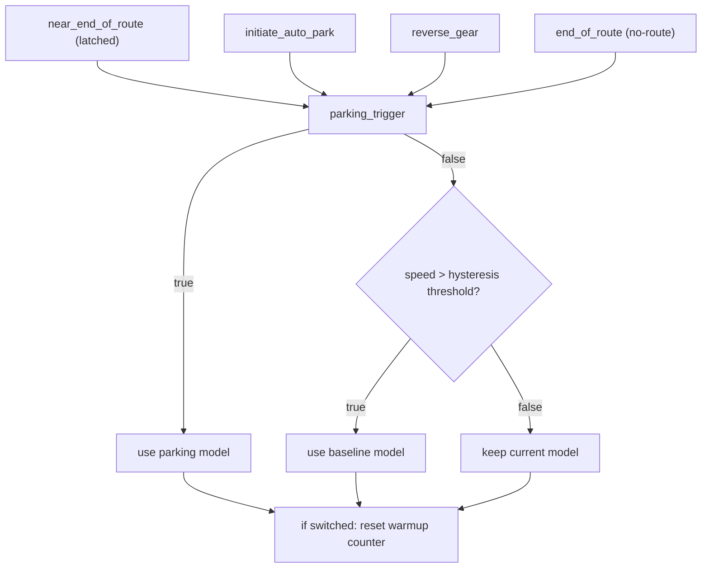

# Interleaving models in parking deployment wrapper

## Overview
- **What it is:** A single deployable model session that interleaves baseline driving and parking behavior inside one deployment wrapper.
- **Why it matters:** Runtime consumes one standard session/model artifact while branch selection happens internally.
- **Primary users:** Parking + deployment validation workflows (sim/HIL/model CI).

## Status
- **Phase:** Phase 2
- **Status:** active
- **Last updated:** 2026-02-08
- **Current priorities:**
  - Keep deploy-path parity with `deploy.py` initialization semantics.
  - Validate robust branch switching in HIL under production switching conditions.
  - Keep interleaving telemetry visible (`interleaved_id`, `interleaved_event`).
- **Blockers:**
  - None.

## Requirements
- **Problem statement:** Build one deployable artifact that can switch baseline/parking behavior without changing downstream runtime integration.
- **Target users:** Deployment engineers validating model behavior in sim/HIL.
- **Integrations:** `deploy_interleaved_models.py`, `interleaving_stopping_wrapper.py`, deploy upload pipeline.
- **Constraints:**
  - Stable TorchScript-compatible input/output contract.
  - Single deployment-wrapper interface.
  - Correct handling of nav inputs, driving controls, gear-related fields, and optional outputs.
- **Success criteria:**
  - Successful compile/upload as a standard deploy model session.
  - Correct switching under route/parking triggers.
  - Stable behavior around switch boundaries.

## Design
- **Wrapper shape:**
  - `RouteInterleavingWrapperImpl` inherits `DeploymentWrapperBase`.
  - Interleaving logic lives in `_forward_with_additional_inputs(...)`.
  - Public `forward(...)` is generated through `make_wrapper_class(...)`.
- **Model loading (intended):**
  - Both models support `wrapper|ingested` load modes.
  - This keeps the configuration symmetric for primary and baseline models.
- **Switching (intended production policy):**
  - Enter parking branch if any trigger is active:
    - near-end-of-route (latched),
    - initiate-auto-park signal,
    - reverse gear,
    - end-of-route/no-route condition.
  - Return to baseline only when parking triggers are inactive and speed hysteresis condition is satisfied.
- **Switch stabilization:**
  - `num_cache_warmup_frames` controls post-switch warmup output reuse.
  - Warmup policy applies only immediately after actual branch transitions.
- **Telemetry:**
  - `interleaved_id` and `interleaved_event` are emitted as observability outputs for active branch and transition frames.

### Switching flow (desired behavior)

## Build Phases
- **Phase:** Phase 1
  - **Goal:** First deployable interleaving wrapper and successful compile/upload.
  - **Validation:** TorchScript compiles and upload succeeds.
- **Phase:** Phase 2
  - **Goal:** Production-grade switching stability in sim/HIL.
  - **Validation:** Switches occur correctly without runtime regressions.

## Decisions
- **2026-02-05:**
  - **Decision:** Use wrapper-level interleaving and ship as one model artifact.
  - **Rationale:** Keeps runtime integration identical to standard single-session deploy consumption.
- **2026-02-05:**
  - **Decision:** Emit `interleaved_id` and `interleaved_event`.
  - **Rationale:** Preserve direct visibility into active branch and switch events.
- **2026-02-08:**
  - **Decision:** Standardize both model load modes to `wrapper|ingested`.
  - **Rationale:** Remove asymmetric behavior and keep configuration consistent across both submodels.

## Reference notes (kept)
### `zmurez/pudo` reference
- `wayve/ai/experimental/compile_with_baseline.py` is the key reference for interleaving compile/deploy behavior and flash-attention handling decisions in that branch.
- It informed parity checks for deploy init behavior and runtime assumptions around switching.

### `main` interleaving wrapper reference
- `wayve/ai/zoo/deployment/interleaved_wrapper.py` is the reference for interleaving telemetry conventions:
  - `interleaved_id`
  - `interleaved_event`
- We keep these signals aligned so model behavior remains inspectable in the same way.

## Notes
- Console link (latest no-cache periodic upload, retained for traceability):
  - `https://console.sso.wayve.ai/model/session_2026_01_28_20_56_18_si_parking_bc_train_wfm_october_2025_pudo_7_17.01_october_wfm_bcinterleaving_30_no_cache`
