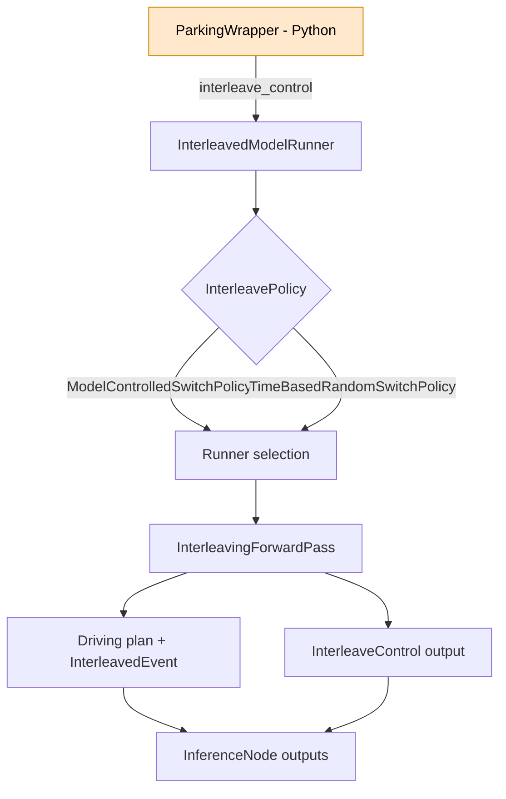

# Interleaving models in parking deployment wrapper

## Overview
- **What it is:** Build a single deployable model that interleaves baseline driving and parking/PUDA models inside a new wrapper.
- **Why it matters:** On‑vehicle inference should see a standard model session ID, while we switch between two models internally.
- **Primary users:** Not specified yet.

## Status
- **Phase:** Phase 1
- **Status:** active
- **Last updated:** 2026-02-03
- **Current priorities:**
  - Define the interleaving wrapper interface and switch predicate.
  - Implement a packer that builds a new TorchScript artifact from two session IDs.
  - Validate that deployment configs and input/output interfaces match.
- **Blockers:**
  - None

## Requirements
- **Problem statement:** Use two already‑compiled TorchScript models (baseline + parking/PUDA) and ship a single deployable model that switches internally based on parking mode / route heuristics.
- **Target users:** Not specified yet.
- **Integrations:** Parking deployment wrapper; session‑ID loaded models; deploy upload pipeline.
- **Constraints:**
  - Session IDs load TorchScript artifacts; interleaving must produce a new TorchScript artifact.
  - Both models must share an identical deployment interface.
- **Success criteria:** A new session ID uploads successfully and behaves like a standard model, while switching internally.

## Design
- **Approach:**
  - Create `InterleavingDeploymentWrapperImpl` that owns baseline + parking wrappers and switches at runtime.
  - Package both models into a single TorchScript artifact and upload it like a normal deploy session.
- **Key decisions:**
  - Use wrapper‑level interleaving (no `interleave_control`).
  - Load both models from session IDs externally, then pass them into the wrapper.
- **Open questions:**
  - Exact switch predicate: parking mode only vs parking mode OR end‑of‑route.
  - How strict to be on deployment_config mismatches.

## Build Phases
- **Phase:** Phase 1
  - **Goal:** Wrapper‑level interleaving with a deployable combined model.
  - **Work items:** Implement wrapper + packer + config checks.
  - **Validation:** Smoke test compile + run + upload.

## Decisions
- **2026-02-03:**
  - **Decision:** Use wrapper‑level interleaving and package as a single TorchScript artifact.
  - **Rationale:** Vehicle/sim expect a standard model session; session IDs are TorchScript.
- **2026-02-03:**
  - **Decision:** Do not use `interleave_control` or InterleavedModelRunner for this path.
  - **Rationale:** We are interleaving inside the wrapper and shipping a single model artifact.

## Notes
- Testing plan not defined yet.

### Findings: how `zmurez/pudo` implements interleaving (reference)
- Interleaving is done in C++ via `InterleavedModelRunner` with transition events and warmup.
- Policy selection:
  - `interleave_control` output → `ModelControlledSwitchPolicy` (falling‑edge switch).
  - Otherwise → `TimeBasedRandomSwitchPolicy`.
- Switching happens in `InterleavedModelRunner::createForwardPass()` and finalizes in `completeTransition()`.
- Runner initialization lives in `createModelRunner()`; runner indices are based on `model_configs` ordering.
- `InterleaveControl` is wired end‑to‑end (proto → DMI output handler → ROS publication).
- Parking wrapper in that branch emits `interleave_control = ~parking` using heuristics.
- Deployment ops note (per Naman Rawal, lead for this area): interleaving is standard for TRT models via a 2‑model experiment; Torchscript SW interleaving isn’t supported in console today.

### Plan: wrapper‑level interleaving (our implementation)

#### 1) New interleaving wrapper
- Add `InterleavingDeploymentWrapperImpl` in `wayve/ai/zoo/deployment/deployment_wrapper.py`.
- It holds two sub‑wrappers:
  - Baseline: `DeploymentWrapperImpl`
  - Parking: `ParkingDeploymentWrapperImpl`
- Forward signature = union of inputs (parking needs gear position + driving_controls).
- Switch predicate: `parking_mode` and/or end‑of‑route heuristic (TBD).
- Output: `OnBoardDrivingOutput` (parking output already includes `policy_gear_position`).

#### 2) Model provisioning (session IDs → one artifact)
- Load baseline + parking **TorchScript** models via `load_ingested_model(session_id)`.
- Validate both deployment configs are compatible (input/output keys, frames, radar, etc.).
- Pass both ScriptModules into `InterleavingDeploymentWrapperImpl`.
- Compile to a **single TorchScript artifact** (new session ID).

#### 3) Deploy‑like packaging + upload
- Add a new script (or extend packer) that mirrors deploy’s upload flow:
  - Inputs: `--baseline_session_id`, `--parking_session_id`, `--output_dir`, `--suffix`, `--upload`.
  - Uses `compile_and_save_model(...)` + `upload_compiled_model(...)` so it appears as a standard model.
- Ensure we pass deploy‑time wrapper options consistently:
  - `deployment_country`, `deployment_vehicle_model_override`, `dilc_on`, `deployment_driving_controls_keys`, `enable_radar_input`.
- Temporal caching: must already match in the compiled session IDs (cannot be toggled post‑compile).

