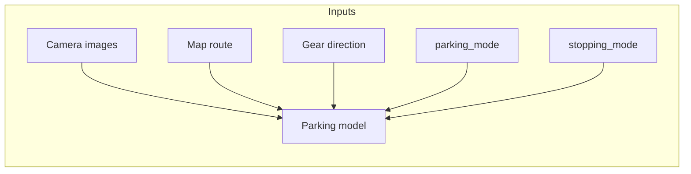
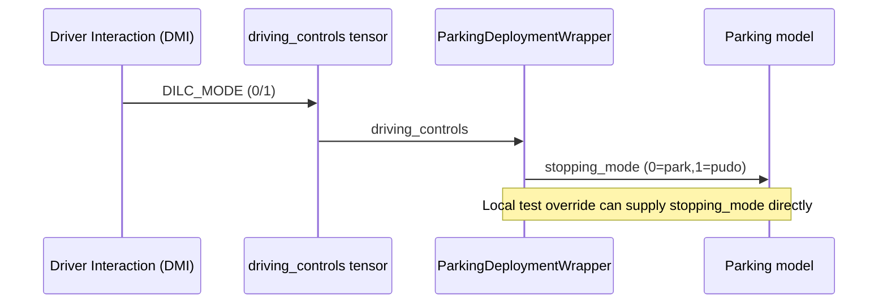

# Parking stopping_mode (DILC -> PUDO)

## Overview
- **What it is:** Add a new model input `stopping_mode` for parking models and map DILC → stopping_mode inside the parking deployment wrapper (OFF→PARK, ON→PUDO).
- **Why it matters:** Allows parking models to distinguish park vs pick-up/drop-off using existing DMI plumbing (DILC) while enabling test-time overrides that bypass DILC.
- **Primary users:** Parking model training/inference owners; deployment wrapper owners.

## Status
- **Phase:** Phase 1
- **Status:** active
- **Last updated:** 2026-01-21
- **Branch:** boris/stopping_mode
- **Current priorities:**
  - Wire DILC → stopping_mode in parking wrapper
- **Blockers:**
  - Unknown: source of PUDO labels / how to populate stopping_mode in training data

## Requirements
- **Problem statement:** Parking models need an explicit stop type input (park vs PUDO). Reuse DILC as the on-board toggle; at test time allow overriding via direct `stopping_mode` input.
- **Target users:** Parking model owners, on-board deployment/inference, local tests.
- **Integrations:** Parking deployment wrapper, DMI driving_controls tensor, driver interaction node (optional if adding real DMI field), ST input adaptors.
- **Constraints:** Use parking model + parking deployment wrapper; keep DILC existing behavior intact for non-parking wrappers; avoid breaking DMI validation.
- **Success criteria:**
  - Parking model accepts `stopping_mode` input (park=0, pudo=1)
  - On-board DILC bit maps to stopping_mode in ParkingDeploymentWrapper
  - Test-time overrides can set stopping_mode without DILC
  - No regressions to existing parking controls (parking_mode, parking_direction, shift_by_wire)

## Design
- **Approach:**
  - Add DataKeys.STOPPING_MODE and a new ST adaptor (similar to parking_mode) with embedding over 2 states.
  - Extend parking model config + ST model builder to optionally include stopping_mode adaptor.
  - Stage OTF augmentation: 10% toggle parking_mode, 90% blackout map to simulate end-of-route.
  - Stage route shortening: replace map route polyline with a truncated segment ending near the gear=0 transition.
  - Finally, extend ParkingDeploymentWrapperImpl to derive stopping_mode from DILC (0=park, 1=pudo), with optional override if stopping_mode already provided in inputs (test path).
- **Key decisions:**
  - Map DILC OFF->PARK, ON->PUDO (explicit requirement).
  - Keep parking wrapper as source of stopping_mode for on-board; allow override in local tests.
- **Open questions:**
  - Where do PUDO labels live (or how to generate) for training data? No `pudo`/`stopping_mode` fields found in current data pipeline.
  - None on DMI: explicitly **not** adding full DMI stopping_mode in this project.

## Build Phases
- **Stage 1: New input adaptor (model-side)**
  - **Goal:** Add `stopping_mode` input to the parking model stack.
  - **Work items:**
    - Add DataKeys.STOPPING_MODE to `wayve/ai/zoo/data/keys.py`.
    - Implement `StoppingModeSTAdaptor` (2-class embedding) in `wayve/ai/zoo/st/input_adaptors/` and register in `__init__.py`.
    - Add adaptor ordering in `wayve/ai/zoo/st/input_adaptors/_input_adaptor.py` (`ADAPTOR_ORDER`).
    - Add `use_stopping_mode_adaptor` config path to `wayve/ai/zoo/st/models.py`.
    - Extend parking configs to enable it: `wayve/ai/si/configs/parking/parking_config.py`.
    - Pass through in training deployment config if needed: `wayve/ai/si/models/training.py`.
  - **Validation:** Unit tests for adaptor shape + input mapping (similar to parking_mode/gear_direction tests).
  - **Status:** Implemented (2026-01-21).
- **Stage 2: OTF augmentation (route shortening near stop)**
  - **Goal:** For parking-detected frames, truncate the route polyline to end near the parking entry point.
  - **Work items:**
    - Extend `insert_parking_data_with_route_shortening` in `wayve/ai/zoo/data/parking.py` to compute parking entry distance.
    - Pass `enable_route_shortening_for_parking` through OTF and into `insert_map_data`.
    - Truncate route polyline (and speed limits) in `RouteMapFetcher` before `generate_route_map_from_config`.
  - **Validation:** Optional unit tests for truncated polyline length and non-empty map output.
  - **Status:** Implemented (2026-01-22). Route shortening now uses stop-route index (start of neutral segment) to truncate the polyline; distance-based shortening remains as fallback.
- **Stage 3: Connect DILC → stopping_mode in parking wrapper**
  - **Goal:** On-board DILC toggles stopping_mode (OFF=park, ON=pudo).
  - **Work items:**
    - Add DILC to parking `deployment_driving_controls_keys` in `wayve/ai/si/models/training.py#get_deployment_config`.
    - Update `ParkingDeploymentWrapperImpl._add_driving_controls_inputs` in `wayve/ai/zoo/deployment/deployment_wrapper.py` to map DILC to DataKeys.STOPPING_MODE.
    - Allow local test overrides by respecting an existing stopping_mode input if present.
    - Update visualization helper mapping (`wayve/ai/si/visualisation/inference_model.py`) if needed.
  - **Validation:** Wrapper unit tests and sanity inference test.
  - **Status:** Not started.
- **Stage 4: OTF stopping_mode targets (hazard-based + random mix)**
  - **Goal:** Populate stopping_mode for parking samples using hazard lights and randomization.
  - **Work items:**
    - In `insert_parking_data_with_route_shortening` / `_add_parking_mode`, when shortening applies (90%):
      - If hazard lights were used (indicator on), set `stopping_mode = 3` (PUDO); else `stopping_mode = 2` (PARK).
    - For the 10% no-shortening bucket, set `stopping_mode` randomly to `{1,2,3}`.
    - Default `stopping_mode` to `1` (not available) when no parking stop detected or route shortening disabled.
    - Use `ground_truth__state__vehicle__indicator_light` with parking lookahead indices to detect hazards.
    - Add/confirm DataKeys for `stopping_mode` values: 1=NA, 2=PARK, 3=PUDO.
  - **Validation:** Spot-check distributions in a small batch; ensure stopping_mode exists for both 90% and 10% branches.
  - **Status:** Implemented (2026-01-22). Hazard is derived from `ground_truth__state__vehicle__indicator_light` at the entry frame.

## Decisions
- **2026-01-20:** Use DILC as the on-board toggle for stopping_mode (OFF->PARK, ON->PUDO); allow test-time override by setting stopping_mode directly.
- **2026-01-21:** Steps 1–3 plan updated: (1) stopping_mode adaptor, (2) route shortening near parking entry (no blackout), (3) DILC → stopping_mode wiring.
- **2026-01-22:** Route shortening now anchors to neutral-segment entry; 90% shorten with parking_mode forced OFF, 10% keep parking_mode ON (no shortening). Balanced windows set to 120s/200m.
- **2026-01-22:** OTF stopping_mode targets: 90% shorten → hazard-based park/pudo (2/3); 10% no-shorten → random {1,2,3}; default 1 when no stop.
- **2026-01-22:** Added `VehicleStoppingMode` enum (1=NA, 2=PARK, 3=PUDO) and mapped OTF stopping_mode to enum values.
- **2026-01-22:** Hazard detection uses `indicator_light == "hazard"` within ±10s of neutral-segment entry (lookahead window).
- **2026-01-22:** Bokeh visualisation: load checkpoints with missing stopping_mode weights (strict=False) and display stopping_mode in parking plot header.

## Notes
- **Current DILC flow (main):**
  - DILC is `DrivingControlKey.DILC_MODE` in `wayve/interfaces/protobuf/driver_interaction.proto`.
  - DMI tensorizer maps `dilc_mode` into `driving_controls` when DILC_MODE is present: `wayve/robot/nodes/inference_node/model_runner/dmi/inputs/driver_interaction/driver_interaction_tensorizer.cpp`.
  - `BehaviorCustomizer` masks `vehicle_indicator_state` by DILC (0/1) for behavior-control wrappers: `wayve/ai/zoo/deployment/behavior_customization.py`.
  - `prepare_base_inputs` also zeros indicator state when `dilc_on=False`: `wayve/ai/zoo/deployment/deployment_wrapper.py`.
  - Parking wrapper does not currently include DILC in driving_controls keys (defaults to INITIATE_AUTO_PARKING, PARKING_DIRECTION, ENABLE_SHIFT_BY_WIRE), so DILC is ignored for parking.
- **Parking wrapper inputs (main):**
  - `ParkingDeploymentWrapperImpl` derives `PARKING_MODE`, `PARKING_DIRECTION`, `ENABLE_SHIFT_BY_WIRE` from driving_controls and passes them via DataKeys: `wayve/ai/zoo/deployment/deployment_wrapper.py`.
  - `PARKING_MODE` is also inserted in training data via `insert_parking_data` (parking mode heuristic on neutral gear segments): `wayve/ai/zoo/data/parking.py`, wired in `wayve/ai/si/datamodules/otf.py`.
- **Route map generation (OTF):**
  - `insert_map_data` calls `fetch_route_map`: `wayve/ai/zoo/data/driving.py`.
  - `RouteMapFetcher` builds maps from `route_polyline`, `last_waypoint_index`, `fraction_to_next_waypoint`: `wayve/ai/lib/data/pipes/routes.py`.
  - `generate_route_map_from_config` draws the route and returns a black map when polyline is empty: `wayve/ai/lib/routes.py`.
- **Parking driving_controls keys (main):**
  - Training deployment config only includes parking controls when `use_parking_mode` is enabled, and only includes DILC when `enable_behavior_control` is true: `wayve/ai/si/models/training.py#get_deployment_config`.
  - `ensure_default_driving_keys` defaults to DILC if driving_controls_keys is empty: `wayve/ai/si/deploy.py`.
