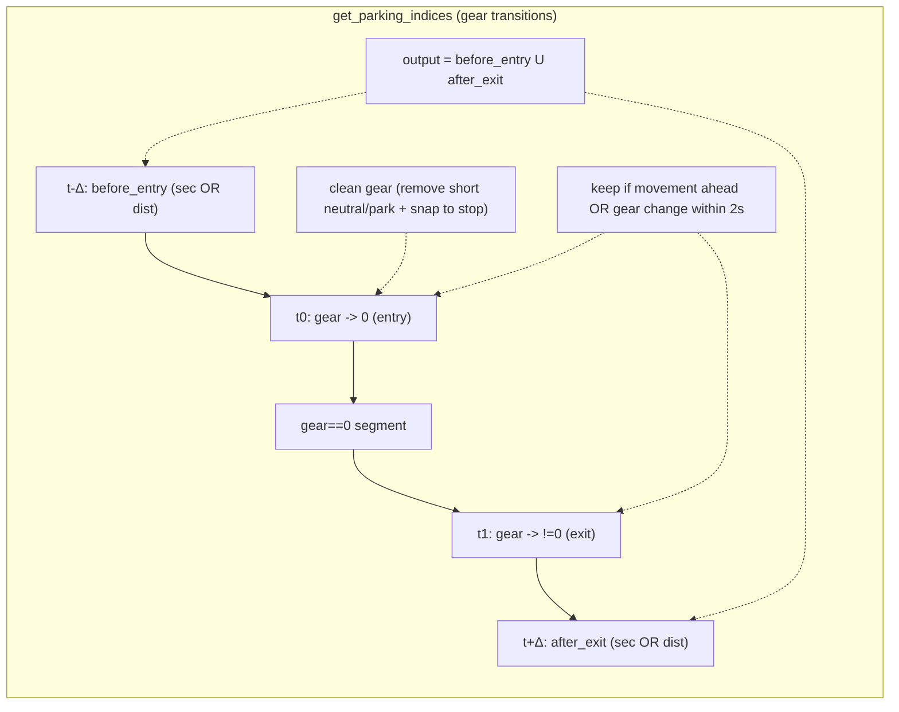
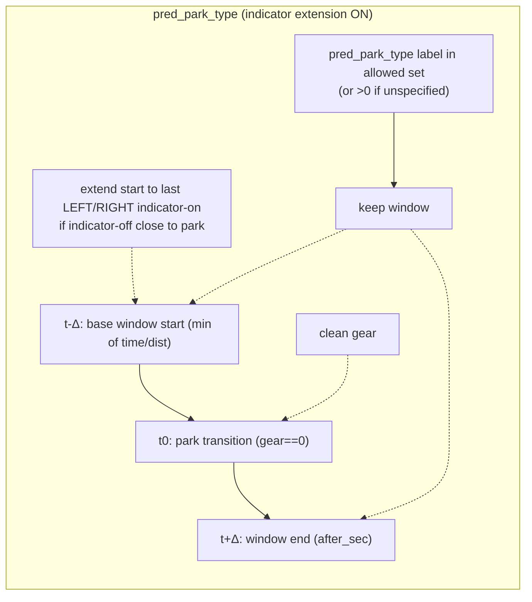
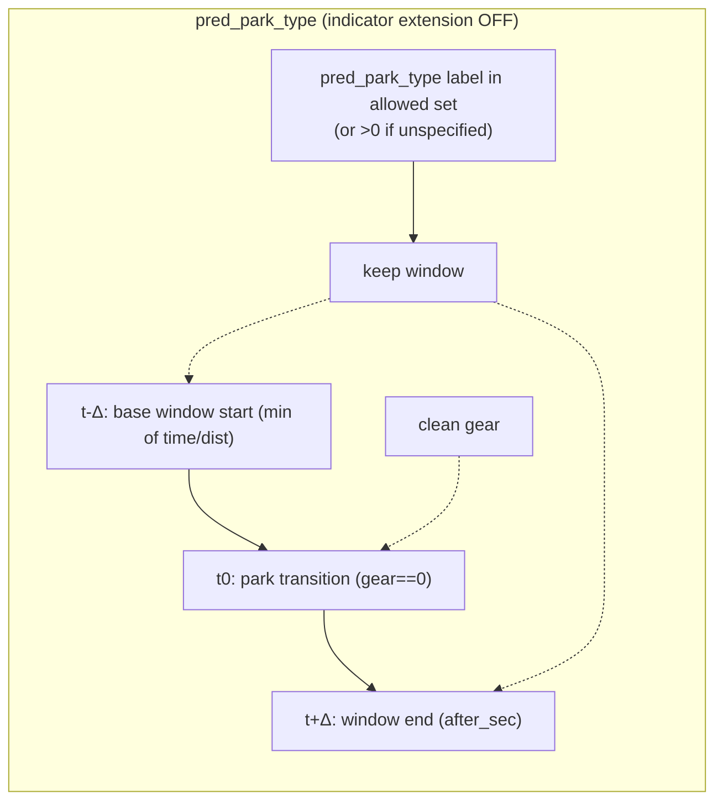
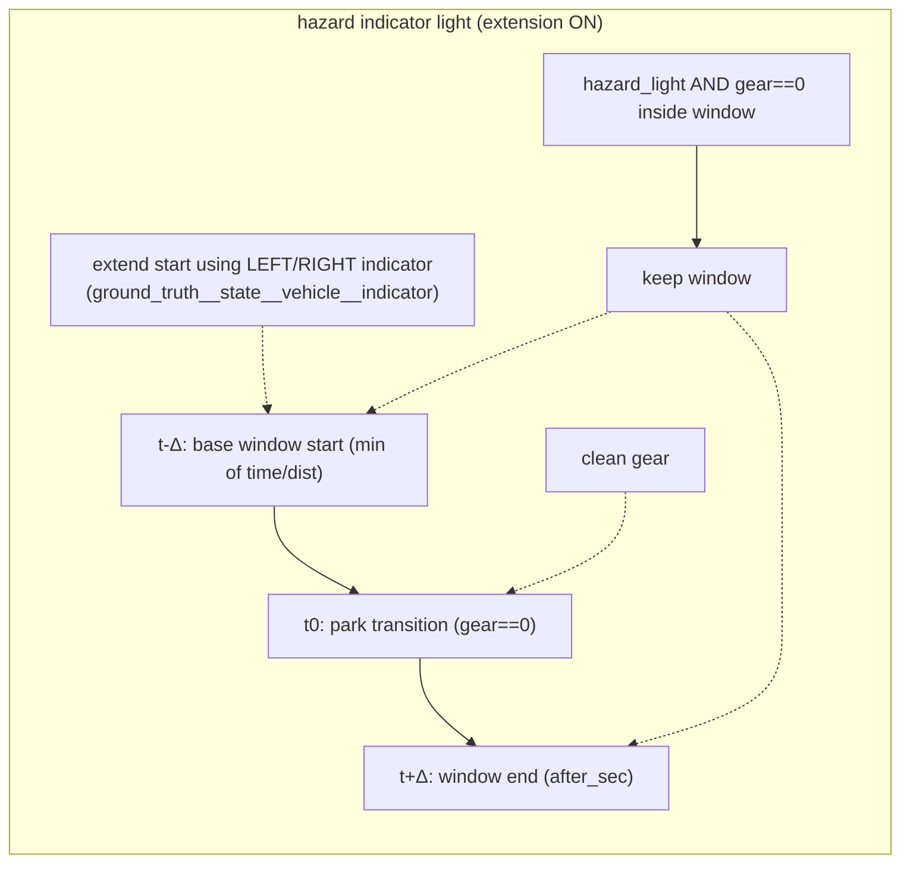
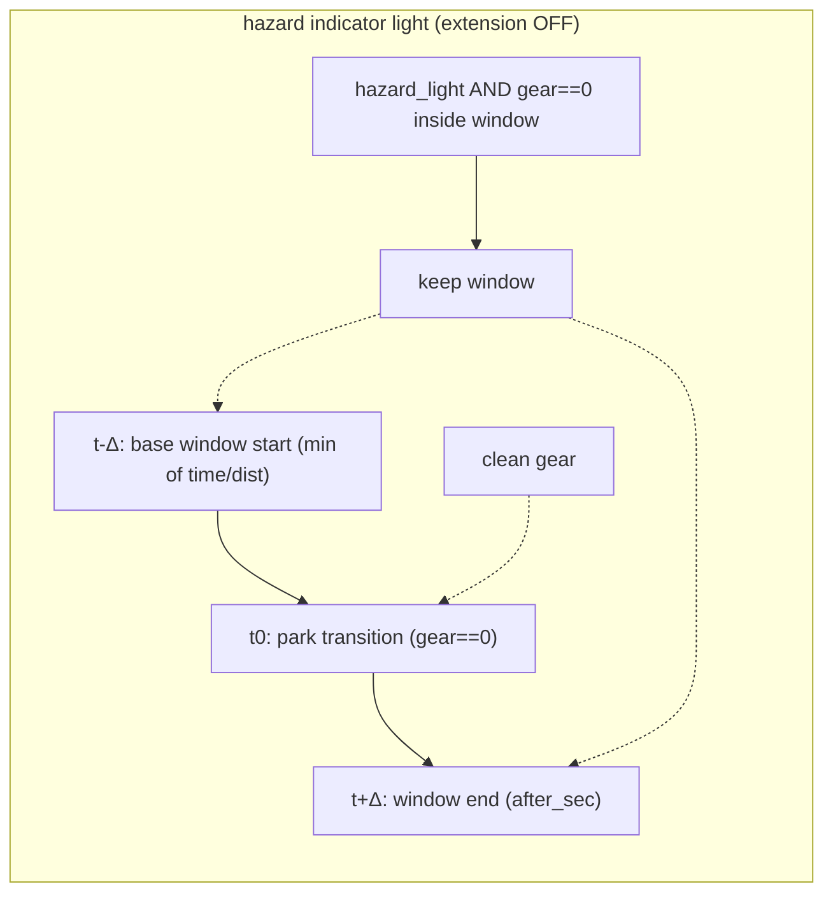

# Zak classifiers parking maneuver

## Overview
- **What it is:** Port experimental parking maneuver windowing logic into SI materialization as a reusable filter with tests.
- **Why it matters:** Aligns SI sampling with experimental parking behavior and reduces bad parking samples.
- **Primary users:** Parking model owners, data/annotation pipeline maintainers.

## Status
- **Phase:** Phase 3
- **Status:** active
- **Last updated:** 2026-01-13
- **Current priorities:**
  - Validate hazard indicator bucket behavior with default mask changes.
  - Run/repair tests for the parking maneuver filter path.
  - Decide whether to add a hazard-specific mask set that keeps hazard frames.
- **Blockers:**
  - None

## Requirements
- **Problem statement:** Experimental parking maneuver filters live outside SI materialization; need a reusable SI filter and tests.
- **Target users:** SI materialization users, parking maneuver pipeline owners.
- **Integrations:** SI filters (`wayve/ai/zoo`), annotation loading, unit tests.
- **Constraints:** Keep behavior consistent with experimental logic; avoid broad refactors.
- **Success criteria:** Filter behavior matches experimental logic; tests pass on target suite.

## Design
- **Approach:** Reuse experimental parking maneuver mask logic in SI filters; add hazard indicator light filter; wire pred_park_type annotations; clean gear before transition detection.
- **Key decisions:** Use SI filter helper + targeted unit tests; keep changes localized; move hazard mask to defaults.
- **Open questions:** Any remaining deltas between experimental sampler filters and SI filter behavior?

## Filter Timeline (Mermaid)

## Parking Buckets (from `wayve/ai/zoo/sampling/buckets.py`)
| Bucket name | Category | Func | Masks | Country | Platform | Auto |
| --- | --- | --- | --- | --- | --- | --- |
| `dc_parking_uk` | DC | `get_parking_indices` | `PARKING_DC_MASKS` | GBR | GEN2_MACHE | no |
| `dc_parking_usa` | DC | `get_parking_indices` | `PARKING_DC_MASKS` | USA | GEN2_MACHE | no |
| `dc_parking_deu` | DC | `get_parking_indices` | `PARKING_DC_MASKS` | DEU | GEN2_MACHE | no |
| `dc_partner_mb_parking_uk` | DC (partner_mb) | `get_parking_indices` | `PARKING_DC_MASKS` | GBR | MB | no |
| `dc_partner_mb_parking_usa` | DC (partner_mb) | `get_parking_indices` | `PARKING_DC_MASKS` | USA | MB | no |
| `dc_partner_mb_parking_deu` | DC (partner_mb) | `get_parking_indices` | `PARKING_DC_MASKS` | DEU | MB | no |
| `dc_parking_long_uk` | DC long | `get_parking_indices(30s/30m)` | `PARKING_DC_MASKS` | GBR | GEN2_MACHE | no |
| `dc_parking_long_usa` | DC long | `get_parking_indices(30s/30m)` | `PARKING_DC_MASKS` | USA | GEN2_MACHE | no |
| `dc_parking_long_deu` | DC long | `get_parking_indices(30s/30m)` | `PARKING_DC_MASKS` | DEU | GEN2_MACHE | no |
| `dc_partner_mb_parking_long_uk` | DC long (partner_mb) | `get_parking_indices(30s/30m)` | `PARKING_DC_MASKS` | GBR | MB | no |
| `dc_partner_mb_parking_long_usa` | DC long (partner_mb) | `get_parking_indices(30s/30m)` | `PARKING_DC_MASKS` | USA | MB | no |
| `dc_partner_mb_parking_long_deu` | DC long (partner_mb) | `get_parking_indices(30s/30m)` | `PARKING_DC_MASKS` | DEU | MB | no |
| `ca_short_parking_uk` | CA short | `intersection(short_ca, parking)` | `PARKING_DC_MASKS` | GBR | GEN2_MACHE | yes |
| `ca_short_parking_usa` | CA short | `intersection(short_ca, parking)` | `PARKING_DC_MASKS` | USA | GEN2_MACHE | yes |
| `ca_short_parking_deu` | CA short | `intersection(short_ca, parking)` | `PARKING_DC_MASKS` | DEU | GEN2_MACHE | yes |
| `ca_long_parking_uk` | CA long | `intersection(long_ca, parking)` | `PARKING_DC_MASKS` | GBR | GEN2_MACHE | yes |
| `ca_long_parking_usa` | CA long | `intersection(long_ca, parking)` | `PARKING_DC_MASKS` | USA | GEN2_MACHE | yes |
| `pre_ca_parking_uk` | Pre-CA | `intersection(pre_ca, parking)` | `PARKING_AV_MASKS` | GBR | GEN2_MACHE | yes |
| `pre_ca_parking_usa` | Pre-CA | `intersection(pre_ca, parking)` | `PARKING_AV_MASKS` | USA | GEN2_MACHE | yes |
| `pre_ca_parking_deu` | Pre-CA | `intersection(pre_ca, parking)` | `PARKING_AV_MASKS` | DEU | GEN2_MACHE | yes |

Notes:
- `get_parking_indices(30s/30m)` means `before_entry_sec=30`, `after_exit_sec=30`, `before_entry_m=30`, `after_exit_m=30`.
- `intersection(short_ca, parking)` = `get_corrective_action_indices_short` + `get_parking_indices`.
- `intersection(long_ca, parking)` = `get_corrective_action_indices_long` + `get_parking_indices`.
- `intersection(pre_ca, parking)` = `get_pre_intervention_indices` + `get_parking_indices`.

## Parking Mask Expansion
- Auto column = `include_autonomous_runs` on the bucket.
- `PARKING_DC_MASKS` expands to:
  - `autonomous`
  - `stopped_segment`
  - `diversion_and_lens_obscured_interventions`
  - `known_bad_runs_and_timestamps`
  - `quarantined_runs_and_timestamps`
  - `high_speed`
  - `hazard_indicator`
  - `long_stationary`
  - `start_end_frames`
  - `none_contiguous`
  - `invalid_video_file_name`
  - `constant_speed`
- `PARKING_AV_MASKS` expands to:
  - `out_of_scope_interventions`
  - `known_bad_runs_and_timestamps`
  - `quarantined_runs_and_timestamps`
  - `high_speed`
  - `hazard_indicator`
  - `long_stationary`
  - `start_end_frames`
  - `none_contiguous`
  - `invalid_video_file_name`
  - `constant_speed`
- Masks intentionally excluded from parking base masks:
  - `reverse_or_neutral`, `parking_legacy`, `geofence`
- Additional masks applied in `get_bucket_indices`:
  - `invalid_video_file_name` always (already in defaults).
  - `unknown_indicator` if `exclude_unknown_indicators=True` (default).
  - `robotics_run_filter` if `apply_robotics_run_filters=True`.

## Proposed New Bucket Sets (draft)
Notes:
- Names below are proposed; confirm naming before implementation.
- For “long” PUDO variants, I assumed `distance_before_m=30`, `before_sec=30`, `after_sec=30` for `get_parking_maneuver_indices_from_hazard_indicator_light` (no after-distance parameter exists).

### PUDO_BUCKETS (hazard indicator light)
| Bucket name (proposed) | Category | Func | Masks | Country | Platform | Auto |
| --- | --- | --- | --- | --- | --- | --- |
| `dc_pudo_uk` | DC | `get_parking_maneuver_indices_from_hazard_indicator_light` | `PUDO_DC_MASKS` | GBR | GEN2_MACHE | no |
| `dc_pudo_usa` | DC | `get_parking_maneuver_indices_from_hazard_indicator_light` | `PUDO_DC_MASKS` | USA | GEN2_MACHE | no |
| `dc_pudo_deu` | DC | `get_parking_maneuver_indices_from_hazard_indicator_light` | `PUDO_DC_MASKS` | DEU | GEN2_MACHE | no |
| `dc_partner_mb_pudo_uk` | DC (partner_mb) | `get_parking_maneuver_indices_from_hazard_indicator_light` | `PUDO_DC_MASKS` | GBR | MB | no |
| `dc_partner_mb_pudo_usa` | DC (partner_mb) | `get_parking_maneuver_indices_from_hazard_indicator_light` | `PUDO_DC_MASKS` | USA | MB | no |
| `dc_partner_mb_pudo_deu` | DC (partner_mb) | `get_parking_maneuver_indices_from_hazard_indicator_light` | `PUDO_DC_MASKS` | DEU | MB | no |
| `dc_pudo_long_uk` | DC long | `hazard_window(30s/30m)` | `PUDO_DC_MASKS` | GBR | GEN2_MACHE | no |
| `dc_pudo_long_usa` | DC long | `hazard_window(30s/30m)` | `PUDO_DC_MASKS` | USA | GEN2_MACHE | no |
| `dc_pudo_long_deu` | DC long | `hazard_window(30s/30m)` | `PUDO_DC_MASKS` | DEU | GEN2_MACHE | no |
| `dc_partner_mb_pudo_long_uk` | DC long (partner_mb) | `hazard_window(30s/30m)` | `PUDO_DC_MASKS` | GBR | MB | no |
| `dc_partner_mb_pudo_long_usa` | DC long (partner_mb) | `hazard_window(30s/30m)` | `PUDO_DC_MASKS` | USA | MB | no |
| `dc_partner_mb_pudo_long_deu` | DC long (partner_mb) | `hazard_window(30s/30m)` | `PUDO_DC_MASKS` | DEU | MB | no |
| `ca_short_pudo_uk` | CA short | `intersection(short_ca, hazard)` | `PUDO_DC_MASKS` | GBR | GEN2_MACHE | yes |
| `ca_short_pudo_usa` | CA short | `intersection(short_ca, hazard)` | `PUDO_DC_MASKS` | USA | GEN2_MACHE | yes |
| `ca_short_pudo_deu` | CA short | `intersection(short_ca, hazard)` | `PUDO_DC_MASKS` | DEU | GEN2_MACHE | yes |
| `ca_long_pudo_uk` | CA long | `intersection(long_ca, hazard)` | `PUDO_DC_MASKS` | GBR | GEN2_MACHE | yes |
| `ca_long_pudo_usa` | CA long | `intersection(long_ca, hazard)` | `PUDO_DC_MASKS` | USA | GEN2_MACHE | yes |
| `pre_ca_pudo_uk` | Pre-CA | `intersection(pre_ca, hazard)` | `PUDO_AV_MASKS` | GBR | GEN2_MACHE | yes |
| `pre_ca_pudo_usa` | Pre-CA | `intersection(pre_ca, hazard)` | `PUDO_AV_MASKS` | USA | GEN2_MACHE | yes |
| `pre_ca_pudo_deu` | Pre-CA | `intersection(pre_ca, hazard)` | `PUDO_AV_MASKS` | DEU | GEN2_MACHE | yes |

### PARKING_LABELED_BUCKETS (pred_park_type)
| Bucket name (proposed) | Category | Func | Masks | Country | Platform | Auto |
| --- | --- | --- | --- | --- | --- | --- |
| `dc_parking_uk_labeled` | DC | `get_parking_maneuver_indices_from_pred_park_type` | `PARKING_DC_MASKS` | GBR | GEN2_MACHE | no |
| `dc_parking_usa_labeled` | DC | `get_parking_maneuver_indices_from_pred_park_type` | `PARKING_DC_MASKS` | USA | GEN2_MACHE | no |
| `dc_parking_deu_labeled` | DC | `get_parking_maneuver_indices_from_pred_park_type` | `PARKING_DC_MASKS` | DEU | GEN2_MACHE | no |
| `dc_partner_mb_parking_uk_labeled` | DC (partner_mb) | `get_parking_maneuver_indices_from_pred_park_type` | `PARKING_DC_MASKS` | GBR | MB | no |
| `dc_partner_mb_parking_usa_labeled` | DC (partner_mb) | `get_parking_maneuver_indices_from_pred_park_type` | `PARKING_DC_MASKS` | USA | MB | no |
| `dc_partner_mb_parking_deu_labeled` | DC (partner_mb) | `get_parking_maneuver_indices_from_pred_park_type` | `PARKING_DC_MASKS` | DEU | MB | no |
| `dc_parking_long_uk_labeled` | DC long | `pred_park_window(30s/30m)` | `PARKING_DC_MASKS` | GBR | GEN2_MACHE | no |
| `dc_parking_long_usa_labeled` | DC long | `pred_park_window(30s/30m)` | `PARKING_DC_MASKS` | USA | GEN2_MACHE | no |
| `dc_parking_long_deu_labeled` | DC long | `pred_park_window(30s/30m)` | `PARKING_DC_MASKS` | DEU | GEN2_MACHE | no |
| `dc_partner_mb_parking_long_uk_labeled` | DC long (partner_mb) | `pred_park_window(30s/30m)` | `PARKING_DC_MASKS` | GBR | MB | no |
| `dc_partner_mb_parking_long_usa_labeled` | DC long (partner_mb) | `pred_park_window(30s/30m)` | `PARKING_DC_MASKS` | USA | MB | no |
| `dc_partner_mb_parking_long_deu_labeled` | DC long (partner_mb) | `pred_park_window(30s/30m)` | `PARKING_DC_MASKS` | DEU | MB | no |
| `ca_short_parking_uk_labeled` | CA short | `intersection(short_ca, pred_park)` | `PARKING_DC_MASKS` | GBR | GEN2_MACHE | yes |
| `ca_short_parking_usa_labeled` | CA short | `intersection(short_ca, pred_park)` | `PARKING_DC_MASKS` | USA | GEN2_MACHE | yes |
| `ca_short_parking_deu_labeled` | CA short | `intersection(short_ca, pred_park)` | `PARKING_DC_MASKS` | DEU | GEN2_MACHE | yes |
| `ca_long_parking_uk_labeled` | CA long | `intersection(long_ca, pred_park)` | `PARKING_DC_MASKS` | GBR | GEN2_MACHE | yes |
| `ca_long_parking_usa_labeled` | CA long | `intersection(long_ca, pred_park)` | `PARKING_DC_MASKS` | USA | GEN2_MACHE | yes |
| `pre_ca_parking_uk_labeled` | Pre-CA | `intersection(pre_ca, pred_park)` | `PARKING_AV_MASKS` | GBR | GEN2_MACHE | yes |
| `pre_ca_parking_usa_labeled` | Pre-CA | `intersection(pre_ca, pred_park)` | `PARKING_AV_MASKS` | USA | GEN2_MACHE | yes |
| `pre_ca_parking_deu_labeled` | Pre-CA | `intersection(pre_ca, pred_park)` | `PARKING_AV_MASKS` | DEU | GEN2_MACHE | yes |

## Build Phases
- **Phase:** Phase 3
  - **Goal:** Validate and finalize filter + tests.
  - **Work items:**
    - Verify the branch implementation against experimental references.
    - Run SI filter tests and fix failures.
  - **Validation:** `bazel test //wayve/ai/zoo:test_sampling_py_test //wayve/ai/zoo:test_sampling_py_lint_pylint --test_output=errors`

## Decisions
- **2026-01-08:**
  - **Decision:** Continue from existing branch `boris/2025-12-30/zak-classifiers-parking-maneuver`.
  - **Rationale:** Prior work already implemented the filter and test skeleton.
- **2026-01-13:**
  - **Decision:** Add hazard indicator light parking filter and clean gear in parking indices; remove hazard mask toggle in favor of default masking.
  - **Rationale:** Align sampling behavior with hazard-specific logic and simplify mask configuration.

## Notes
- Task summary: [[2025/12/Week-5/2025-12-30-parking-maneuver-filter-task-summary]].
- Task summary: [[2026/01/Week-3/2026-01-13-parking-hazard-filter-updates]].
