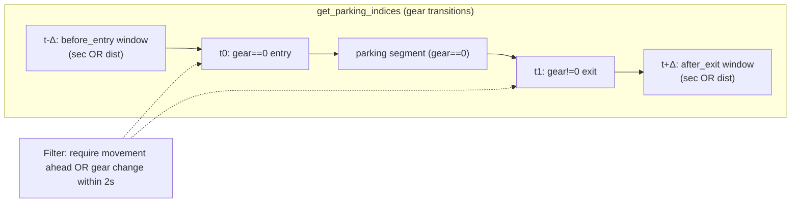
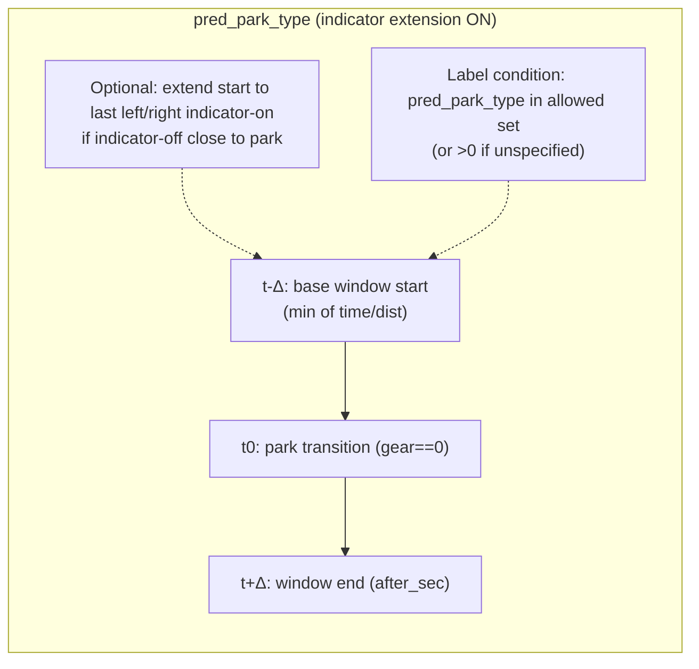
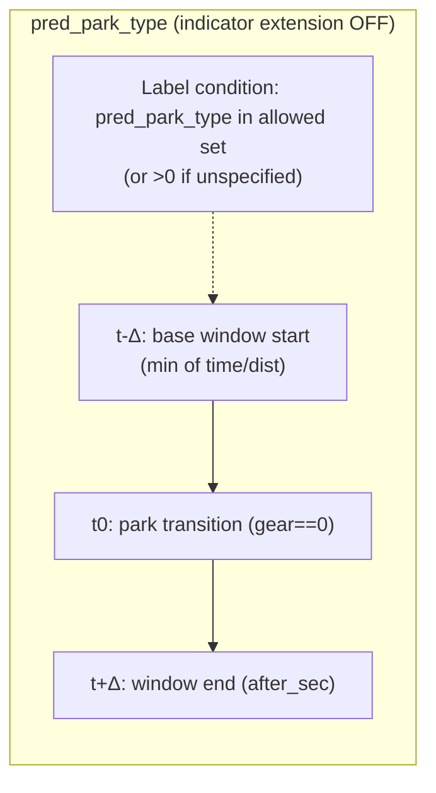
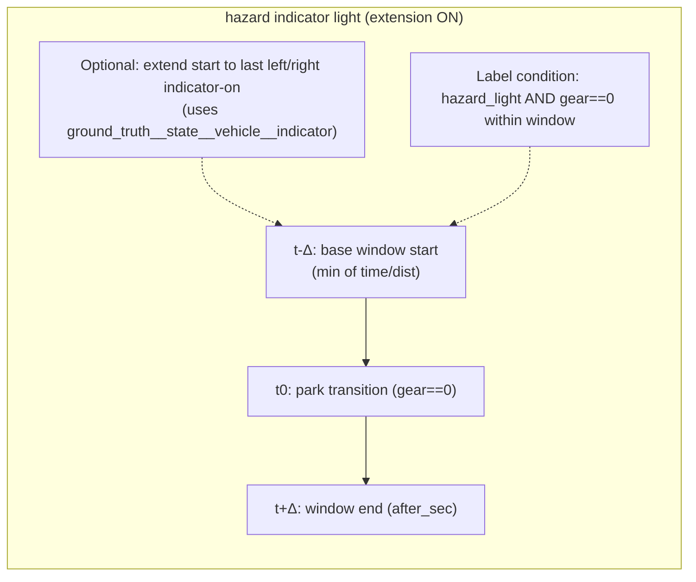
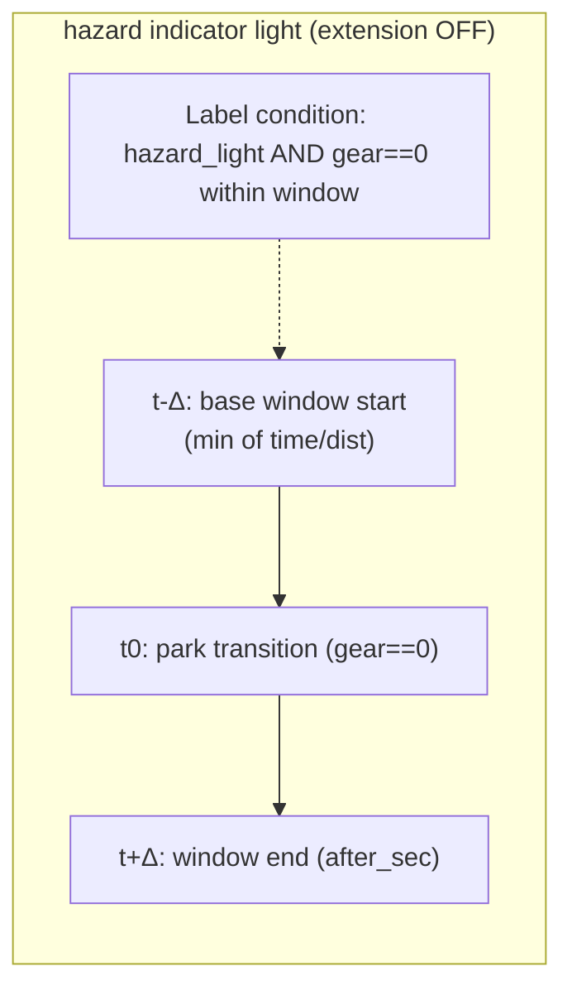

# Zak classifiers parking maneuver

## Overview
- **What it is:** Port experimental parking maneuver windowing logic into SI materialization as a reusable filter with tests.
- **Why it matters:** Aligns SI sampling with experimental parking behavior and reduces bad parking samples.
- **Primary users:** Parking model owners, data/annotation pipeline maintainers.

## Status
- **Phase:** Phase 3
- **Status:** active
- **Last updated:** 2026-01-13
- **Current priorities:**
  - Validate hazard indicator bucket behavior with default mask changes.
  - Run/repair tests for the parking maneuver filter path.
  - Decide whether to add a hazard-specific mask set that keeps hazard frames.
- **Blockers:**
  - None

## Requirements
- **Problem statement:** Experimental parking maneuver filters live outside SI materialization; need a reusable SI filter and tests.
- **Target users:** SI materialization users, parking maneuver pipeline owners.
- **Integrations:** SI filters (`wayve/ai/zoo`), annotation loading, unit tests.
- **Constraints:** Keep behavior consistent with experimental logic; avoid broad refactors.
- **Success criteria:** Filter behavior matches experimental logic; tests pass on target suite.

## Design
- **Approach:** Reuse experimental parking maneuver mask logic in SI filters; add hazard indicator light filter; wire pred_park_type annotations; clean gear before transition detection.
- **Key decisions:** Use SI filter helper + targeted unit tests; keep changes localized; move hazard mask to defaults.
- **Open questions:** Any remaining deltas between experimental sampler filters and SI filter behavior?

## Filter Timeline (Mermaid)

## Build Phases
- **Phase:** Phase 3
  - **Goal:** Validate and finalize filter + tests.
  - **Work items:**
    - Verify the branch implementation against experimental references.
    - Run SI filter tests and fix failures.
  - **Validation:** `bazel test //wayve/ai/zoo:test_sampling_py_test //wayve/ai/zoo:test_sampling_py_lint_pylint --test_output=errors`

## Decisions
- **2026-01-08:**
  - **Decision:** Continue from existing branch `boris/2025-12-30/zak-classifiers-parking-maneuver`.
  - **Rationale:** Prior work already implemented the filter and test skeleton.
- **2026-01-13:**
  - **Decision:** Add hazard indicator light parking filter and clean gear in parking indices; remove hazard mask toggle in favor of default masking.
  - **Rationale:** Align sampling behavior with hazard-specific logic and simplify mask configuration.

## Notes
- Task summary: [[2025/12/Week-5/2025-12-30-parking-maneuver-filter-task-summary]].
- Task summary: [[2026/01/Week-3/2026-01-13-parking-hazard-filter-updates]].
