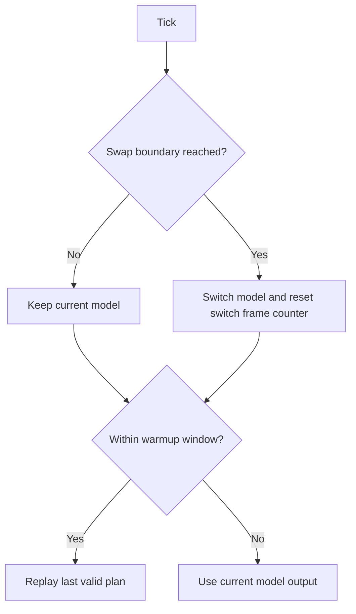
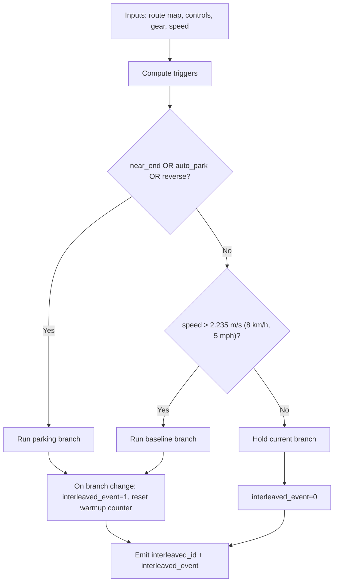
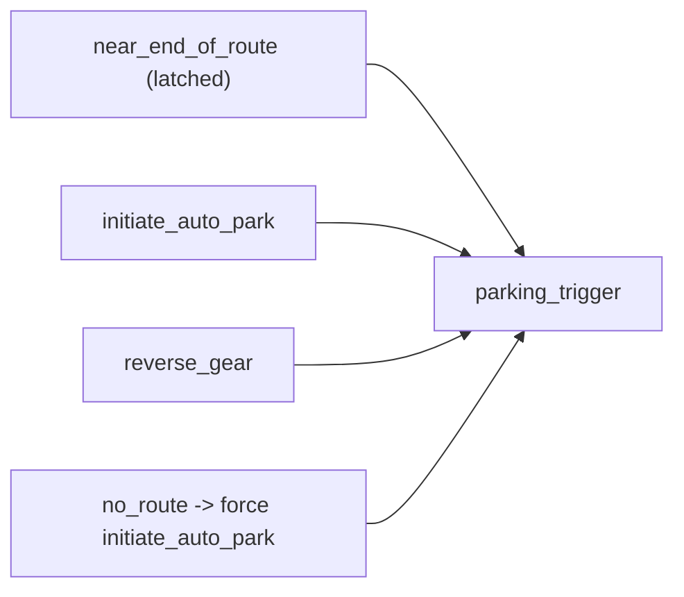

# Newsletter: The Interleaving Dispatch — Production Design Edition

## Why this exists
We want one model artifact that inference-node can load like any normal deployment wrapper, while internally deciding between:
- baseline driving policy
- parking policy

That keeps robot integration simple and moves policy arbitration into model logic where we can version and validate it.

## Where it lives
- Wrapper implementation: `wayve/ai/zoo/deployment/interleaving_stopping_wrapper.py`
- Deploy entrypoint: `wayve/ai/si/deploy_interleaved_models.py`
- Key class: `RouteInterleavingWrapperImpl(DeploymentWrapperBase)`

The public `forward(...)` signature is generated via `make_wrapper_class(...)`, but the real behavior is in `_forward_with_additional_inputs(...)`, consistent with wrapper-style deploy flow.

## Current production-shape design
### Model loading (intended steady state)
Both branches support the same load modes:
- `wrapper`
- `ingested`

Design intent is symmetry: avoid branch-specific behavior differences unless explicitly required.

### Switching logic (intended production behavior)
Parking branch is selected when any of these are true:
- near-end-of-route (latched)
- `INITIATE_AUTO_PARKING` control is on
- reverse gear is engaged

Additional rule:
- if route is effectively gone, force parking-initiate in the primary controls path.

Return to baseline happens only when:
- no parking trigger is active, and
- speed is above hysteresis threshold.

### Physical threshold interpretation
- `near_end_of_route_sum_thresh = 5e3` is about **46 m** of a 1-pixel route line.
- `end_of_route_sum_thresh = 2.5e2` is about **2.3 m** of a 1-pixel route line.
- speed hysteresis threshold `2.235 m/s` = **8.0 km/h** = **5.0 mph**.
- near-end unlatch hysteresis uses **50 m**.

## Telemetry: what downstream sees
`RouteInterleavingOutput` carries normal policy tensors plus interleaving signals:
- `interleaved_id`: active branch id (baseline vs parking)
- `interleaved_event`: switch event flag for this frame

`interleave_control` note:
- it exists in interface mapping (`interfaces_v2`) as a supported field type,
- current wrapper path uses `interleaved_id` + `interleaved_event` as the active observability contract,
- if `interleave_control` is needed downstream, it should be explicitly wired as a separate product decision.

## How this compares to Zak’s implementation
### `zmurez/pudo` (`wayve/ai/experimental/compile_with_baseline.py`)
Important references:
- explicit post-swap cache warmup handling
- replaying last valid plan through warmup window
- compile/runtime compatibility handling around attention paths

### `main` (`wayve/ai/zoo/deployment/interleaved_wrapper.py`)
Used as canonical telemetry semantics reference:
- `interleaved_id`
- `interleaved_event`

## Flow diagrams
### 1) Zak-style time-based interleave with warmup replay


### 2) Robot-target trigger-based interleave


### 3) Parking-trigger composition


## Latest uploaded sessions (reference)
- `session_2026_01_28_20_56_18_si_parking_bc_train_wfm_october_2025_pudo_7_17.01_october_wfm_bc__interleaved_fixed_cleanup`
  - `https://console.sso.wayve.ai/model/session_2026_01_28_20_56_18_si_parking_bc_train_wfm_october_2025_pudo_7_17.01_october_wfm_bc__interleaved_fixed_cleanup`
- `session_2026_02_04_13_44_32_si_parking_bc_train_wfm_october_2025_pudo_only_31.01_october_wfm_bc__interleaved_new_primary`
  - `https://console.sso.wayve.ai/model/session_2026_02_04_13_44_32_si_parking_bc_train_wfm_october_2025_pudo_only_31.01_october_wfm_bc__interleaved_new_primary`

## Recommended deploy shape
```bash
bazel run //wayve/ai/si:deploy_interleaved_models -- \
  --baseline_model_session_id <baseline_session_id> \
  --baseline_model_load_mode wrapper \
  --primary_model_load_mode wrapper \
  --session_id <parking_session_id> \
  --suffix <new_suffix> \
  --dilc_on \
  --enable_parking \
  --with_temporal_caching true \
  --upload
```

## Guardrails
1. Keep deploy initialization aligned with `wayve/ai/si/deploy.py`.
2. Keep switching ownership in the interleaving wrapper (avoid split logic across wrappers).
3. Keep `interleaved_id` / `interleaved_event` stable for observability.
4. Keep debug-only switches out of production design docs and release artifacts.
