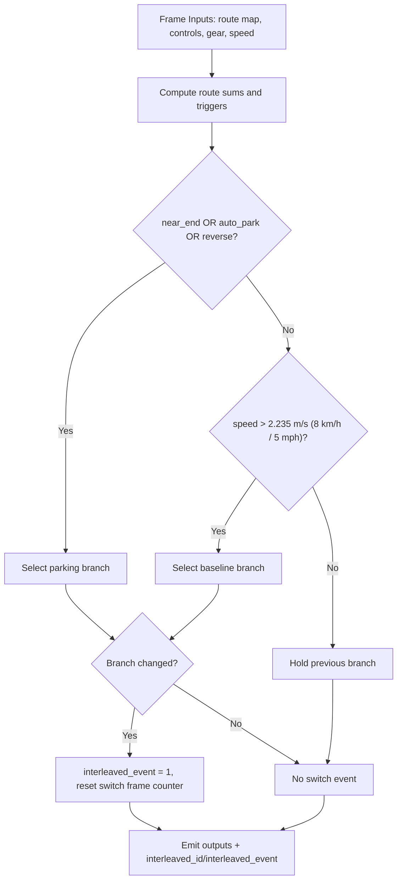

# Newsletter: Interleaving Models in the Parking Deployment Wrapper

## 1) Summary
We ship one model artifact that behaves like a normal deployment wrapper for the robot, but internally chooses between two policies:
- baseline driving model
- parking model

The interleaving decision is based on route completion signals, parking controls, gear state, and speed hysteresis. This keeps robot integration simple while allowing policy arbitration inside the model artifact.

## 2) Branch Name and Main Code Components
### Working branch
- `boris/train/parking_pudo_interleaving`

### Reference branches
- `main`: `wayve/ai/zoo/deployment/interleaved_wrapper.py` (telemetry conventions)
- `zmurez/pudo`: `wayve/ai/experimental/compile_with_baseline.py` (swap warmup and robustness patterns)

### Main code components
- Interleaving wrapper implementation:
  - `wayve/ai/zoo/deployment/interleaving_stopping_wrapper.py`
- Deploy entrypoint:
  - `wayve/ai/si/deploy_interleaved_models.py`
- Wrapper codegen path:
  - `wayve/ai/zoo/deployment/deployment_wrapper_codegen.py`
- Route-map options (window/scale/width):
  - `wayve/ai/zoo/route_map.py`

## 3) How to Run Deployment Command
```bash
bazel run //wayve/ai/si:deploy_interleaved_models -- \
  --baseline_model_session_id <baseline_session_id> \
  --session_id <primary_parking_session_id> \
  --baseline_model_load_mode wrapper \
  --primary_model_load_mode wrapper \
  --suffix __interleaved_fixed_cleanup \
  --dilc_on \
  --enable_parking \
  --with_temporal_caching true \
  --route_end_sum_thresh 1.2e4 \
  --route_no_sum_thresh 6.5e3 \
  --upload
```

Notes:
- `route_end_sum_thresh` is the near-end trigger.
- `route_no_sum_thresh` is the effectively-no-route trigger.
- SI medium route config uses `window_size=(50, 2000)`, so the map includes `50m` behind ego.

### Meters -> pixels / threshold conversion
For `si_medium` defaults (`image_size_px=512`, `map_scale_m=1200`):

- Along-route pixels per meter:
  - `px_per_m = image_size_px / map_scale_m = 512 / 1200 = 0.4267`
- So route length in pixels is:
  - `route_length_px ~= distance_m * 0.4267`
- For threshold planning with a single-pixel-thick line and one active channel:
  - `signal_per_meter ~= 255 * px_per_m = 108.8`
  - `threshold ~= visible_route_m * 108.8`

Examples:
- `50m -> ~21.3 px` and `~5440` signal units
- `5m -> ~2.13 px` and `~544` signal units

## 4) How Interleaving Works
Each frame, the wrapper computes:
- route-based trigger (near-end/no-route from route map sum)
- operator trigger (`INITIATE_AUTO_PARKING`)
- gear trigger (reverse)
- speed hysteresis condition (`speed_switch_mps = 2.235 m/s = 8.0 km/h = 5.0 mph`)

Behavior:
- Switch to parking if any parking trigger is active.
- Keep parking latched until parking triggers clear and speed hysteresis allows return.
- If route is effectively gone, force parking-initiate in primary controls.
- On branch swap, emit switch event and apply cache warmup behavior.

## 5) Switching State Machine


## 6) interleave_control, interleaved_id, interleaved_event
### What exists
- `interleaved_id`: branch identity for this frame (`baseline` vs `parking`).
- `interleaved_event`: one-frame switch marker (`1` when branch changed, else `0`).
- `interleave_control`: interface-level concept available in schema space, but not used as the active output contract in this implementation.

### What we chose to do
- Keep the runtime contract explicit and minimal:
  - always emit `interleaved_id`
  - always emit `interleaved_event`
- Do not add `interleave_control` into active wrapper output path unless a downstream consumer explicitly needs it.
- This keeps observability stable and avoids introducing another semantically-overlapping signal.
