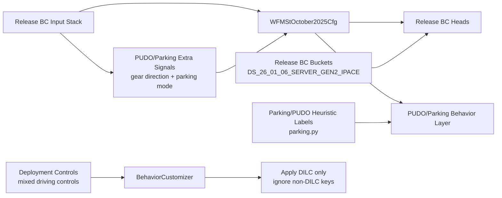

# Newsletter: PUDO update to current driving release

## Why this work was needed
Parking/PUDO had to stay aligned with the active driving release while still preserving robotaxi-specific behavior (pickup/dropoff cues, parking transitions, deployment controls).  
This update focused on keeping architecture parity with release, aligning data semantics, and removing deployment-time mismatches that were causing training/runtime failures.

## Branch and scope
- Branch: `boris/train/pudo_11_02_26`
- Project note: `projects/pudo-update-current-driving-release.md`
- Main objective: keep parking/PUDO model behavior close to release BC behavior, then layer parking/PUDO-specific inputs and heuristics where needed.

## Release baseline we aligned to
Release BC in `wayve/ai/si/configs/baseline/release.py` is centered on:
- `WFMStOctober2025Cfg` model stack and preprocess (`wayve/ai/si/configs/baseline/release.py:212`)
- release dataset partitions rooted at `DS_26_01_06_SERVER_GEN2_IPACE` (`wayve/ai/si/configs/baseline/release.py:53`)
- behavior-control-capable output adaptor flow inherited from config core (`wayve/ai/si/config.py:1911`, `wayve/ai/si/config.py:1931`)

In short: release BC remains the reference architecture and data profile.

## What changed in this PUDO stream

### 1) Parking mode heuristic was made explicit and test-backed
- Added parking-mode computation around neutral-gear entry windows in `wayve/ai/zoo/data/parking.py:15`.
- Added insertion path and guardrails requiring additional lookahead gear/speed data in `wayve/ai/zoo/data/parking.py:106`.
- Integrated helper paths in driving datapipe support (`wayve/ai/zoo/data/driving.py:243`, `wayve/ai/zoo/data/driving.py:257`).

### 2) Gear-direction data handling was hardened
- Standardized unavailable/unknown gear direction encoding to int8 sentinel:
  `GEAR_DIRECTION_UNKNOWN_INT8 = 2` in `wayve/ai/zoo/data/driving.py:103`.
- Updated adaptor import/use of unavailable direction in
  `wayve/ai/zoo/st/input_adaptors/gear_direction.py:6` and mapping logic at `wayve/ai/zoo/st/input_adaptors/gear_direction.py:33`.

### 3) Deployment behavior customization stopped rejecting valid parking/PUDO controls
- `BehaviorCustomizer` now applies only DILC behavior and ignores non-DILC control keys:
  `wayve/ai/zoo/deployment/behavior_customization.py:133`.
- Regression tests cover both non-DILC-only and mixed control tuples:
  `wayve/ai/zoo/deployment/test/test_behavior_customization.py:212`,
  `wayve/ai/zoo/deployment/test/test_behavior_customization.py:234`.

## Architecture view (release parity + PUDO additions)

## Key commits in this branch (PUDO/release-alignment stream)
- `e4a40f2b7b1` parking mode heuristic + tests
- `18471f00bd1` gear direction unavailable fix
- `eef49fd0ecf` gear direction adaptor import fix
- `8a26aa7eba7` behavior customization mixed-control fix

## Practical takeaway
This branch keeps release BC as the architectural anchor and narrows PUDO-specific differences to:
- data/label semantics for parking transitions,
- gear-direction/parking-mode handling,
- deployment control interpretation (DILC-only behavior customization).

That keeps parity high while still supporting robotaxi pickup/dropoff behavior.
