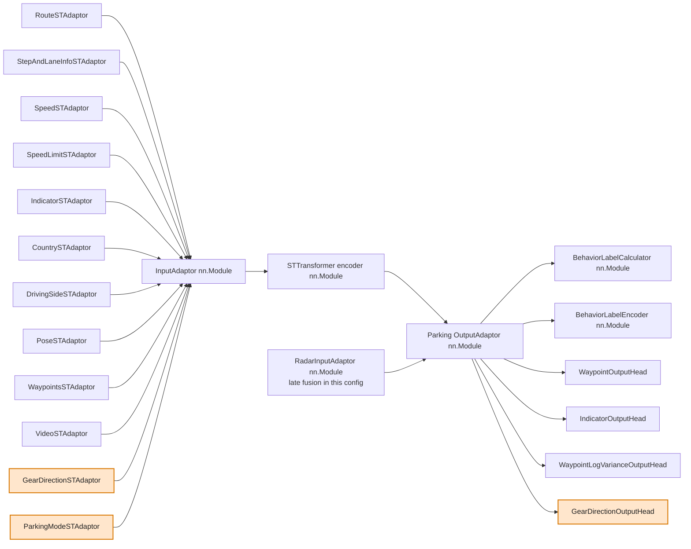

# Newsletter: PUDO update to January driving release 2026.5.4

Branch: `boris/train/pudo_11_02_26`

## Summary
- Data: use release driving data and add PUDO data, with `93% driving / 7% PUDO`.
- Architecture: align parking/PUDO with release behavior+navigation path.
- Model deltas: add parking/PUDO-specific input adaptors (`gear_direction`, `parking_mode`) and keep gear-direction output head in the parking/PUDO adaptor stack.

## Config-level changes
- Release baseline config:
  - `wayve/ai/si/configs/baseline/release.py`
- Parking/PUDO training config:
  - `wayve/ai/si/configs/parking/parking_config.py`
- Model assembly path:
  - `wayve/ai/zoo/st/models.py` (`build_space_time_model`)
- Output adaptor / heads:
  - `wayve/ai/zoo/outputs/output_adaptor.py`
  - `wayve/ai/zoo/outputs/gear_direction_output_head.py`
- ST + input adaptor paths:
  - `wayve/ai/zoo/st/input_adaptors/gear_direction.py`
  - `wayve/ai/zoo/st/input_adaptors/parking_mode.py`

## Model components diagram (`torch.nn.Module` only)

Notes:
- The module list above is from both config wiring and model-construction code, not config-only.
- Relative to release BC 2026.5.4, parking/PUDO additions are the highlighted modules: `GearDirectionSTAdaptor`, `ParkingModeSTAdaptor`, and `GearDirectionOutputHead`.
- Radar path in this parking/PUDO config is late-fusion (`radar_late_fusion=True`), so radar tokens go to `OutputAdaptor` and not through `STTransformer`.

## Takeaway
Parking/PUDO now follows the release-style model path (behavior + nav) and differs mainly in data mix plus the parking/PUDO-specific gear/parking-mode IO additions.
