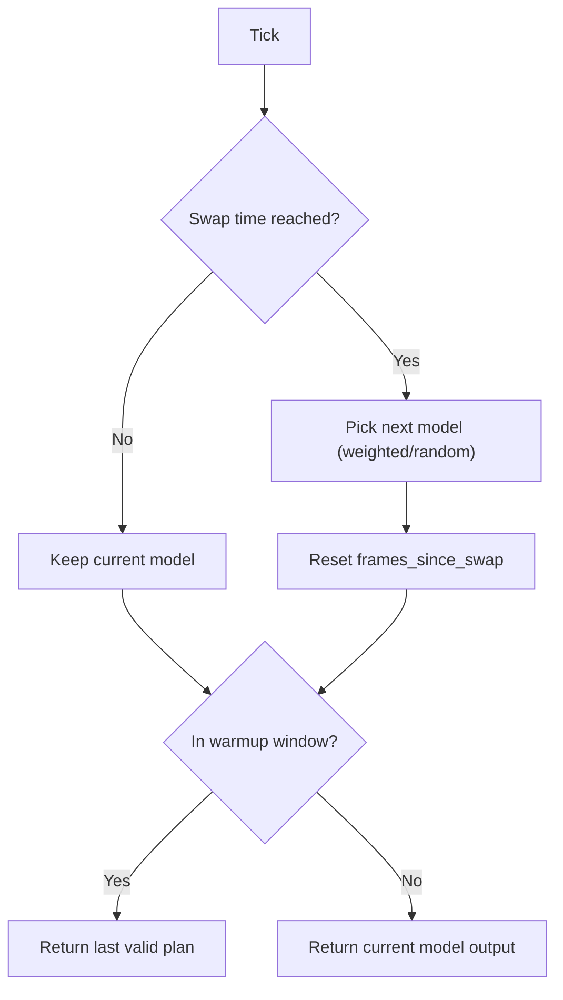
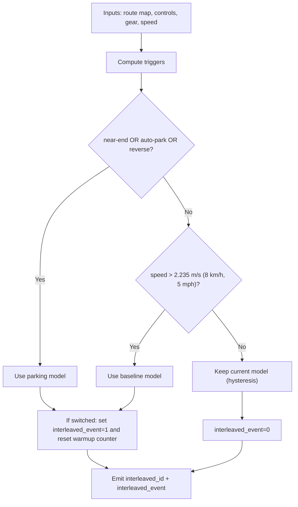
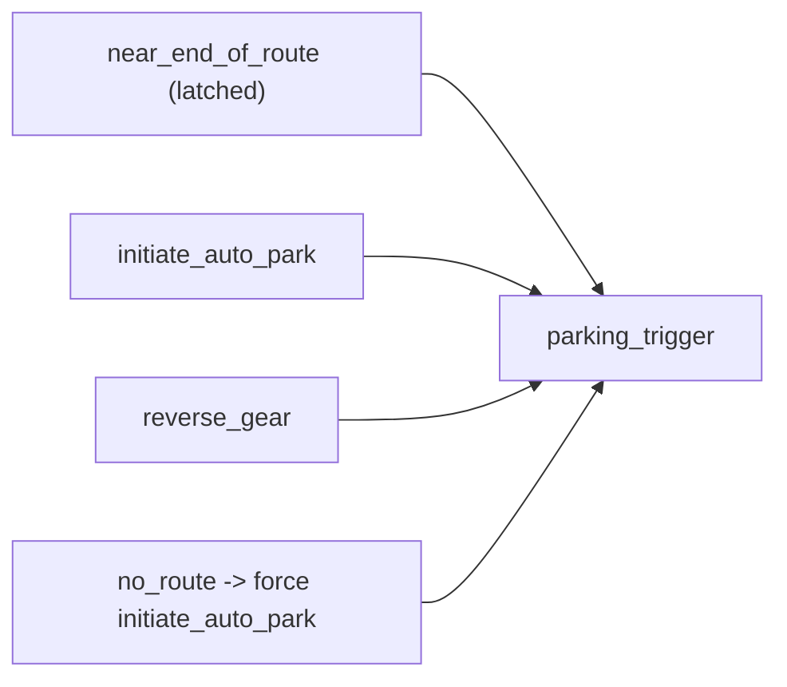

# Interleaving models in parking deployment wrapper

## Overview
- **What it is:** A single deployable model session that can run either baseline driving behavior or parking behavior inside one deployment wrapper.
- **Why it matters:** Inference-node consumes one normal model artifact; branch switching happens internally without changing runtime integration.
- **Primary users:** Parking + deployment validation workflows (sim/HIL/model CI), vehicle-test request owners.

## Status
- **Phase:** Phase 2
- **Status:** active
- **Last updated:** 2026-02-11
- **Current priorities:**
  - Keep deploy-path parity with `deploy.py` initialization/load semantics.
  - Validate robust branch switching in HIL under real trigger conditions.
  - Keep branch telemetry visible (`interleaved_id`, `interleaved_event`) in logs and model outputs.
- **Blockers:**
  - None currently in code compile/upload path.
  - Runtime behavior still depends on HIL scenario coverage of actual switch triggers.

## Latest uploaded sessions
- **Latest (new primary parking session):**
  - Session: `session_2026_02_04_13_44_32_si_parking_bc_train_wfm_october_2025_pudo_only_31.01_october_wfm_bc__interleaved_new_primary`
  - Console: `https://console.sso.wayve.ai/model/session_2026_02_04_13_44_32_si_parking_bc_train_wfm_october_2025_pudo_only_31.01_october_wfm_bc__interleaved_new_primary`

## Requirements
- **Problem statement:** Build one deployable artifact that can switch baseline/parking behavior without adding runtime orchestration outside the model.
- **Target users:** Deployment engineers validating model behavior in sim/HIL.
- **Integrations:** `deploy_interleaved_models.py`, `interleaving_stopping_wrapper.py`, deploy compile/upload pipeline, model CI/HIL runner.
- **Constraints:**
  - Stable TorchScript-compatible input/output contract.
  - Single deployment-wrapper interface.
  - Correct handling of nav inputs, driving controls, gear-related fields, and optional outputs.
  - Avoid debug-only switching paths in production artifact.
- **Success criteria:**
  - Successful compile/upload as a standard deploy model session.
  - Correct switching under route/parking triggers.
  - Stable behavior around switch boundaries and cache warmup frames.

## Design
- **Wrapper shape:**
  - `RouteInterleavingWrapperImpl` inherits `DeploymentWrapperBase`.
  - Interleaving decision logic lives in `_compute_interleaving_decision(...)`.
  - Runtime entrypoint is `_forward_with_additional_inputs(...)`.
  - Public `forward(...)` is generated by `make_wrapper_class(...)`.
- **Load modes (current intended):**
  - Baseline: `wrapper|ingested`
  - Primary (parking): `wrapper|ingested`
  - Current preferred path for parity: both on `wrapper`.

### Switching policy (production target)
- Enter parking branch if any trigger is active:
  - near-end-of-route (latched),
  - initiate-auto-park control,
  - reverse gear.
- Extra no-route behavior:
  - if route is effectively gone, force initiate-auto-park in primary controls.
- Return to baseline only if:
  - parking triggers are inactive,
  - speed is above hysteresis threshold.

### Thresholds in physical units
- `near_end_of_route_sum_thresh = 5e3` is approximately **46 m** for a 1-pixel route line.
- `end_of_route_sum_thresh = 2.5e2` is approximately **2.3 m** for a 1-pixel route line.
- Speed hysteresis threshold:
  - `2.235 m/s` = `8.0 km/h` = `5.0 mph`.
- Near-end latch hysteresis distance:
  - `50 m` before unlatching after leaving near-end region.

### Warmup behavior
- `num_cache_warmup_frames` controls temporary reuse of previous branch outputs immediately after a switch.
- This is used to reduce post-switch instability while feature caches warm up.

## Telemetry and control signals
- **`interleaved_id` (output):**
  - `[1] int64`
  - active branch id (`0` baseline, `1` parking in this implementation).
- **`interleaved_event` (output):**
  - `[1] int64`
  - `1` on a switch frame, otherwise `0`.
- **`interleave_control` (interface field):**
  - Exists in interface mapping (`interfaces_v2`) as a supported output type.
  - Not emitted by current `RouteInterleavingOutput` path.
  - Important note for consumers: use `interleaved_id`/`interleaved_event` for current observability unless `interleave_control` is explicitly wired in a future revision.

## Zak reference vs this wrapper
### `zmurez/pudo` reference (`wayve/ai/experimental/compile_with_baseline.py`)
- Key ideas used as reference:
  - Explicit handling of cache warmup immediately after a swap.
  - Reuse of last valid plan for initial post-swap frames.
  - Flash-attention path handling for TorchScript runtime compatibility.
- This reference was used to align compile/runtime assumptions and warmup strategy.

### `main` reference (`wayve/ai/zoo/deployment/interleaved_wrapper.py`)
- Key conventions mirrored:
  - `interleaved_id`
  - `interleaved_event`
- This keeps logs and observability semantics comparable across wrappers.

## Flow diagrams
### Zak-style reference flow (time-driven swap + warmup replay)

### Robot-target flow (trigger-driven swap + hysteresis)

### Decision signal structure

## Decisions
- **2026-02-05:**
  - **Decision:** Use wrapper-level interleaving and ship as one model artifact.
  - **Rationale:** Keeps runtime integration identical to standard single-session deploy consumption.
- **2026-02-05:**
  - **Decision:** Emit `interleaved_id` and `interleaved_event`.
  - **Rationale:** Direct visibility into active branch and switch events.
- **2026-02-08:**
  - **Decision:** Keep both model load modes symmetric (`wrapper|ingested`).
  - **Rationale:** Reduced configuration asymmetry and easier parity checks.
- **2026-02-11:**
  - **Decision:** Remove temporary `switch_every_n_forwards` debug path from production wrapper.
  - **Rationale:** Keep switching policy deterministic and trigger-driven for vehicle behavior.

## Notes
- This page documents intended production behavior and current deployed shape.
- Temporary debug experiments should be tracked in task notes and run ledgers, not treated as target design.
