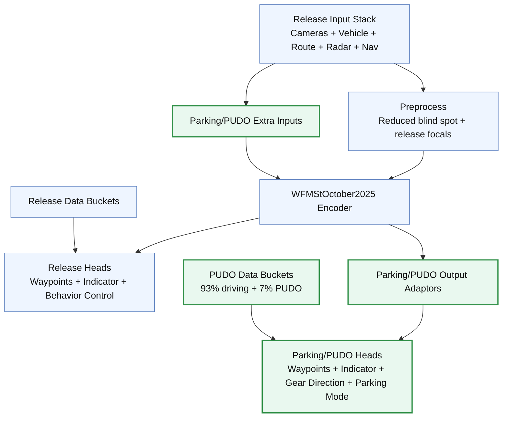

# PUDO update to current driving release

## Overview
- **What it is:** A follow-up project connected to [[projects/parking-wfm-update]] to align the PUDO (Pick Up / Drop Off) stack with the current driving release.
- **Why it matters:** We need architecture and data-bucket parity with the current driving release while preserving PUDO/parking behavior needed for robotaxi pickup and dropoff.
- **Primary users:** Training/inference engineers working on parking + PUDO deployment and model release readiness.

## Status
- **Phase:** Phase 2 (Phase 1 complete)
- **Status:** active
- **Last updated:** 2026-02-11
- **Current priorities:**
  - Run/collect remaining `wayve/ai/si` validation checks after recent `parking_config.py` root/binary updates.
  - Keep `otf.py` parking-flag behavior unchanged unless a regression appears.
  - Re-check branch drift impact before final training kickoff.
- **Blockers:**
  - High branch drift from `main` (`792` commits in `main` not in branch, `98` commits in branch not in `main`).

## Requirements
- **Problem statement:** Update PUDO to the current driving release with matching architecture and data buckets, while reusing validated parking/PUDO behaviors.
- **Target users:** Robotaxi PUDO model owners and deployment/training maintainers.
- **Integrations:**
  - `release.py` (current driving release reference)
  - `parking_config.py` from `boris/train/parking_pudo` (bucket source)
  - deployment wrapper end-of-route implementation
  - `otf.py` parking-flag path
- **Constraints:**
  - Work branch: `boris/train/pudo_11_02_26`
  - Keep close alignment with `main` unless required deviations are documented.
- **Success criteria:**
  - Architecture alignment documented and validated.
  - PUDO buckets sourced from `boris/train/parking_pudo` and integrated.
  - End-of-route wrapper behavior ported/verified.
  - `otf.py` parking-flag flow verified as expected for parking/PUDO.

## Design
- **Approach:** Incremental parity pass: baseline diff vs `main`, model/release summaries, then targeted config/wrapper/OTF updates.
- **Key decisions:**
  - Treat current driving `release.py` as primary reference.
  - Treat `boris/train/parking_pudo` `parking_config.py` as bucket source of truth for this migration.
- **Open questions:**
  - Which parts of current `main` should be backported before final training, given current drift.
  - Do PUDO buckets need adaptation for current training data schemas?

## Release vs Parking/PUDO Model Diagram

- Parking and PUDO share the same model architecture.
- The difference is data composition (`parking` buckets vs `PUDO` buckets).

## Build Phases
- **Phase: Phase 1 - Discovery and parity mapping**
  - **Goal:** Establish exact deltas and lock implementation plan.
  - **Work items:**
    - [x] Diff `boris/train/pudo_11_02_26` vs `main` and flag dramatic release/training changes.
    - [x] Summarize current parking model architecture (as baseline relative to PUDO).
    - [x] Summarize current driving release in `release.py`.
    - [x] Pull and summarize PUDO bucket definitions from `boris/train/parking_pudo` `parking_config.py`.
    - [x] Compare current parking buckets vs PUDO buckets and list required config edits.
    - [x] Identify deployment wrapper end-of-route implementation to reuse/port.
    - [x] Verify `otf.py` parking-flag behavior is equivalent/compatible for this migration.
    - [x] Produce final action order for implementation + validation.
  - **Validation:**
    - [x] Checklist reviewed and accepted before code changes.

- **Phase: Phase 2 - Implementation + validation**
  - **Goal:** Apply changes and verify training/deployment behavior.
- **Work items:**
  - [x] Implement approved wrapper updates (single `ParkingDeploymentWrapperImpl` with behavior+nav parity + end-of-route logic).
  - [x] Implement `parking_config.py` root/bucket/binary updates for release+PUDO split.
  - [ ] Run remaining targeted checks/tests (blocked previously by ACR auth for one `py_test` target).
  - **Validation:**
    - [ ] All agreed checks pass.

## Decisions
- **2026-02-11:**
  - **Decision:** Start from branch `boris/train/pudo_11_02_26`, check drift to `main`, and use `boris/train/parking_pudo` bucket config as migration source.
  - **Rationale:** Minimizes integration risk while preserving known-good PUDO bucket definitions and current release alignment.
- **2026-02-11 (follow-up):**
  - **Decision:** Disallow parking-only deployment path; parking deployment must run with behavior-control + navigation path by default.
  - **Rationale:** Keep parking/PUDO deployment aligned with driving deployment architecture and avoid dual-path drift.

## Phase 1 Summary (2026-02-11)
- **Branch drift check (`boris/train/pudo_11_02_26` vs `origin/main`):**
  - `git rev-list --left-right --count origin/main...HEAD` => `792 98`.
  - Relevant changed files include `wayve/ai/si/configs/parking/parking_config.py`, `wayve/ai/si/datamodules/otf.py`, `wayve/ai/zoo/deployment/deployment_wrapper.py`.
  - Main release file history confirms active promotions (`Release 2026.5.4` in `wayve/ai/si/configs/baseline/release.py`).
- **Current parking model baseline (`wayve/ai/si/configs/parking/parking_config.py`):**
  - Architecture is already parking/PUDO-compatible: `WFMSt100xYoloCfg` with parking-mode + gear-direction adaptors.
  - Data config is parking-centric today (`dc_parking_*`, `ca_*_parking_*`, `pre_ca_parking_*`) with no active `*_pudo_*` buckets.
  - Current data root/binary in this branch: `2025_12_11_12_47_38_server_parking_bc_data`, `binary_version="2.7.68"`.
- **Current driving release summary (`wayve/ai/si/configs/baseline/release.py`):**
  - Baseline BC uses `WFMStOctober2025Cfg` + radar late fusion + radar adaptor, behavior control enabled.
  - Baseline release dataset root is `DS_26_01_06_SERVER_GEN2_IPACE`, `binary_version="2.7.73"`, mode `version="2026.5.4"`.
  - RL baseline points to `DS_26_01_05_OFFLINE_RL_JOINT_ALPHA2_ALPHA3`.
- **PUDO source buckets (`boris/train/parking_pudo:wayve/ai/si/configs/parking/parking_config.py`):**
  - PUDO groups present: `dc_pudo_uk`, `dc_pudo_usa`, `dc_pudo_long_uk`, `dc_pudo_long_usa`, `ca_short_pudo_uk`, `ca_short_pudo_usa`, `ca_long_pudo_uk`, `ca_long_pudo_usa`, `pre_ca_pudo_uk`, `pre_ca_pudo_usa`.
  - Source branch also uses explicit weighting split variables (`driving_weight`, `parking_weight`, `pudo_weight`).
- **Required config edits identified:**
  - Replace active parking train buckets in `wayve/ai/si/configs/parking/parking_config.py` with the PUDO bucket list above (from `boris/train/parking_pudo`).
  - Keep current architecture scaffolding (model/adaptor/loss) unless Phase 2 testing shows mismatch.
  - Decide whether to keep current branch data root/binary or adopt the `parking_pudo` values during implementation.
- **Deployment wrapper reuse target:**
  - `boris/train/parking_pudo` has `enable_end_of_route_parking`, `_end_of_route_mask()`, and OR-merge into `DataKeys.PARKING_MODE`.
  - Current branch file `wayve/ai/zoo/deployment/deployment_wrapper.py` lacks this end-of-route merge and should port it in Phase 2.
- **`otf.py` parking-flag parity check:**
  - Current `wayve/ai/si/datamodules/otf.py` keeps parking insertion behavior and is stricter than source (guard on `parking_lookahead_sec > 0`, explicit parking origin from timeslicer).
  - Conclusion: behavior is compatible; no immediate `otf.py` change required for bucket migration.
- **Phase 2 implementation order:**
  - 1. Update `parking_config.py` train bucket groups from parking to PUDO (source: `boris/train/parking_pudo`).
  - 2. Port end-of-route parking path into `ParkingDeploymentWrapperImpl`.
  - 3. Run targeted config/deployment checks and validate parking-mode activation behavior.
  - 4. Re-assess whether selective backports from `main` are needed before training run kickoff.

## Notes
- PUDO = Pick Up / Drop Off for the robotaxi solution.
- Latest prior training reference branch: `boris/train/parking_pudo`.
- 2026-02-11 update: parking deployment now keeps a single wrapper path (no extra parking wrapper class), includes behavior-control/navigation/indicator preprocessing when enabled, and has end-of-route parking trigger at `5.5e2` route-signal threshold (~5m).
- 2026-02-11 follow-up: `prepare_deployment_model(...)` now forces parking to behavior+navigation defaults and raises if callers explicitly disable either feature while `enable_parking=True`.
- 2026-02-11 config follow-up:
  - `parking_config.py` uses `materialised/si/parking/dev/2026_02_03_10_30_34_server_parking_pudo_buckets_bc` for legacy driving buckets, PUDO buckets, and parking validation buckets.
  - `DS_26_01_06_SERVER_GEN2_IPACE` is kept only for `dc_high_lateral_acceleration_uk`, `dc_high_lateral_acceleration_usa`, and `pre_ca_all_gen1`.
  - Added release buckets `dc_high_lateral_acceleration_uk`, `dc_high_lateral_acceleration_usa`, and `pre_ca_all_gen1`.
  - `binary_version` updated to `3.0.1`.
  - Driving sampling scale re-normalized to preserve 93% driving target after adding release buckets (`driving_weight = 0.93 / 0.695`).
- 2026-02-11 indicator/bucket parity follow-up:
  - Added missing release BC train buckets `dc_dilc_indicator_off_{day,night}_{usa,uk,deu,jpn}` with root `DS_26_01_06_SERVER_GEN2_IPACE`.
  - Re-normalized driving sampling scale to keep the exact `93%` driving / `7%` PUDO split after adding those 8 buckets (`driving_weight = 0.93 / 0.715`).
  - Indicator deployment flow check:
    - Parking wrapper can zero `VEHICLE_INDICATOR_STATE` when `dilc_on=False` via `prepare_base_inputs(...)`.
    - Release driving behavior+nav wrapper path keeps `dilc_on=True` in wrapper forward path.
  - Hazard-state check:
    - Dataset mapping includes `HAZARD=3`, but BC indicator loss masks labels `>2` and the output head is 3-class (off/right/left), so hazards are excluded from supervised indicator prediction in current BC path.
- 2026-02-11 hazard enablement update:
  - Parking/PUDO output adaptor now uses `num_indicator_classes=4` so hazard is representable at the model head.
  - Indicator CE losses are now class-count aware (`max_class_label = logits.shape[-1] - 1`) instead of hard-clamping to `0..2`.
  - Scope is intentionally targeted to parking/PUDO config (`parking_config.py`) while keeping default output adaptor behavior unchanged for non-parking models.
- 2026-02-12 train failure follow-up:
  - Failed run `black-flamingo-fiery-125307` was caused by `OutputAdaptor` init (`enable_behavior_control=True` with missing `latent_action_encoder`).
  - Fixed in `parking_config.py` by setting `latent_action_encoder=ActionsDiscretizerCfg()` with explicit `enable_latent_action=False`.
  - Validation: `bazel test //wayve/ai/si:test_config` passed.
- 2026-02-12 checkpoint-load follow-up:
  - Next failure was strict input-adaptor loading from October pretraining checkpoint after enabling parking adaptors (`gear_direction`, `parking_mode`).
  - Updated `load_multi_input_sttransformer_from_wfm_october_pretraining(...)` to seed missing `gear_direction`/`parking_mode` adaptor params from initialized model defaults before strict load.
  - Validation: `bazel test //wayve/ai/si:test_config` passed.
